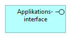

# Vejledning til arkitekturdokumentation med Archimate

## Indledning

Arkitekturdokumentation er centralt for at skabe gode digitale løsninger og for at understøtte kommunikation, udvikling og samarbejde på tværs af digitaliseringsprojekter, myndigheder og sektorer. For at give maksimal værdi bør arkitekturdokumentation være klar, stringent og nem at forstå og fortolke ensartet. Dette sikres bl.a. gennem et formaliseret sprog for arkitekturmodeller.

For at understøtte sammenhæng, samarbejde og deling på tværs, er et **fælles modelsprog** derfor en af de centrale nøgler. Formålet med denne vejledning er at støtte og modne anvendelsen af ArchiMate som fælles modelsprog på tværs af myndigheder og i samarbejdet med leverandører.

Målet er at skabe arkitekturdokumentation der understøtter sammenhæng, samarbejde og genbrug.

Vejledningen introducerer, hvordan arkitekturdokumentation kan udarbejdes i forbindelse med digitalisering og it-anskaffelser med brug af det internationalt standardiserede modelsprog ArchiMate fra Open Group.

Digitaliseringsstyrelsen (DIGST) vil med vejledningen sætte anvendelsen af ArchiMate i en dansk offentlig kontekst, fx i forhold til projekters anvendelse af FDA-rammearkitektur, arkitekturreview og it-projektmodel. Vejledningen skal hjælpe læseren med at forstå, hvordan ArchiMate kan bruges som notations- og modelsprog til at specificere en række arkitekturprodukter.

Vejledningen giver med korte beskrivelser og konkrete eksempler hjælp til at komme i gang med at bruge ArchiMate til en række af de arkitekturprodukter, der er beskrevet i FDA-dokumentet [_Retningslinjer for formidling og dokumentation af arkitektur i digitaliseringsprojekter_](/node/563).

Vejledningen er udarbejdet på et tidspunkt, hvor erfaringer med anvendelse af ArchiMate stadig er relativt begrænsede. Det er derfor forventningen, at vejledningen løbende vil blive opdateret.

### ArchiMate til arkitekturoverblik

Standarden ArchiMate 3.0.1 er valgt som det fælles modelsprog. ArchiMate er et sprog med begreber, grammatik og semantik. Det gør arkitekter i stand til at beskrive arkitekturens forskellige elementer, og ikke mindst sammenhængene mellem dem, på en ensartet og stringent måde. Standarden er dermed velegnet til at give overblik over arkitekturens elementer og vise sammenhænge i et helhedsbillede, der spænder fra “Hvorfor skal vi lave løsningen?” til “Hvordan skal vi lave løsningen?”.

ArchiMate har mange anvendelsesmuligheder, og standarden er i den gældende version modnet til at kunne beskrive hele enterprise-arkitekturen. Sproget favner beskrivelser af alt fra strategi, over opgaveløsning, til applikationer og den underliggende infrastruktur, ligesom realisering af en ønsket arkitektur også kan modelleres.

Indenfor det enkelte projekt, vil brug af et stringent modelsprog til dokumentationen af arkitektur kunne fungere som støtte til afklaring og udvikling af arkitekturen. Herunder særligt i dialogen mellem projektets interessenter, mellem kunden og leverandører, og som stafet fra fx arkitekt til udvikler. Samtidig gør et fælles modelsprog det nemmere at dele og genbruge arkitekturdokumentation og i sidste ende løsninger på tværs af projekter.

ArchiMate understøtter således også arbejdet med enterprise-arkitektur (virksomhedsarkitektur), tværgående program- og it-porteføljestyring – og generelt et tværorganisatorisk samarbejde. Dette behandles dog ikke i denne vejledning.

ArchiMate er velegnet til overblik, afklaring og beslutninger

I denne vejledning fokuseres på et udsnit af mulighederne i ArchiMate, men det enkelte projekt eller den enkelte myndighed kan naturligvis gøre brug af hele standarden efter behov.  Hensigten er at støtte en hurtig ibrugtagning af de vigtigste dele i sproget og at undgå for mange fejl i modellerne. Vejledningen er derfor ikke udtryk for et ønske om at begrænse brugen af sproget.

Som beskrevet i retningslinjer for arkitekturdokumentation, er det ikke hensigten at ArchiMate skal stå alene, som eneste modelleringssprog. Ved detaljeret dokumentation, kan andre modelsprog eller tilgange fungerer bedre (fx BPMN til detaljerede procesmodeller eller UML til detaljerede informationsmodeller).

### Målgruppe og kompetencer

Målgruppen er både personer som udarbejder konkret arkitekturdokumentation (fx it-arkitekter), og medarbejdere, som blot skal bestille, læse og forstå arkitekturdokumentation (fx projektledere eller leverandører).

Projekter tilhørende den Fællesoffentlige digitaliseringsstrategi (FODS) vil være typiske brugere af denne vejledning, men vejledningen er udformet således, at den også kan anvendes i anden sammenhæng.

Projekter kan bruge ArchiMate til dokumentation og dialogstøtte

Anvendelsen af ArchiMate som sprog til at beskrive arkitektur forudsætter kendskab til standarden og kompetencer i forhold til anvendelse. Denne vejledning tager udgangspunkt i en situation, hvor der inden for det offentlige endnu kun findes et begrænset antal medarbejdere med certificeringer i og erfaringer med brug af ArchiMate. Der er derfor lagt vægt på en simpel og hurtig ibrugtagning af standarden.

For at opnå den nødvendige kvalitet i dokumentation af arkitekturen, kræves det rette kompetenceniveau. På det danske marked udbydes der certificeringsforløb i ArchiMate indtil practitioner-niveau af leverandører, der er godkendt af Open Group. Herudover findes en række udbydere af kurser og konsulentydelser, der hjælper virksomheder og myndigheder til at opnå et bredt basiskendskab til ArchiMate, og som kan bistå med at tilpasse anvendelsen til de specifikke formål.

### Læsevejledning

Denne vejledning udspringer af Hvidbogens arkitekturregler 1.3 om anvendelse af fælles ramme for beskrivelse af arkitektur, og herunder mere specifikt _Retningslinjer for formidling og dokumentation af arkitektur i digitaliseringsprojekter_ (i det følgende benævnt [_Retningslinjer om arkitekturdokumentation_](/node/563)), på lige fod med en række andre vejledninger og regler for begrebs- og datamodellering (se Figur 1).

Figur 1: Sammenhæng mellem tre af hvidbogens arkitekturregler til side og underordnede dokumenter

Denne vejledning er overordnet opdelt i to dele.

[_Del 1- Introduktion til ArchiMate i FDA-kontekst_](#Del 1) giver en overordnet introduktion til ArchiMate og sætter brugen af ArchiMate i forhold til en overordnet FDA-kontekst.

[_Del 2 - Arkitekturprodukter - vejledning og eksempler_](#Del 2) skal ses som et opslagsværk, hvor en række af de arkitekturprodukter, der er udvalgt i FDA-regi, gennemgås med vejledning til udarbejdelse, samt eksempler herpå.

## Del 1- Introduktion til ArchiMate i FDA-kontekst

[ArchiMate](http://www.opengroup.org/subjectareas/enterprise/archimate) er optaget som en åben standard under [Open Group](http://www.opengroup.org/) og er i dag en integreret del af arkitekturrammeværket TOGAF.

Du kan læse om ArchiMate version 3.0.1 og dens generelle anvendelse i arkitekturarbejde her: [http://pubs.opengroup.org/architecture/archimate3-doc/toc.html](http://pubs.opengroup.org/architecture/archimate3-doc/toc.html).

### ArchiMate sprogets hovedelementer

ArchiMate giver som modelleringssprog en ensartet repræsentation af diagrammer, der hjælper til at beskrive en løsningsarkitektur eller en organisations enterprise-arkitektur. Ensartetheden sikres ved at standarden definerer en række arkitekturelementer, en tilgang for hvordan de enkelte elementer kan være relateret til hinanden. Derudover er der beskrevet en række specifikke perspektiver (Viewpoints) for udvalgte interessenter, der udvælger de mest relevante elementer og relationer ud fra et defineret anvendelsesformål.

#### Struktur

ArchiMate beskriver og visualiserer forskellige arkitekturdomæner. Sprogets elementer er struktureret i seks lag og fire aspekter, som er forbundet med relationer (kaldet _relationships_). Figur 2viser et overblik over ArchiMate-rammeværket. Alle ArchiMate-elementer er knyttet til et af lagene (_Strategy_, _Business_, _Application_ etc.) og til et af de tre aspekter Passiv struktur, Adfærd og Aktiv struktur. Hertil kommer en række elementer, som hører til det fjerde aspekt kaldet _Motivation_, og som ikke hører til nogen af de seks lag.

Figur 2: ArchiMate-rammeværket

#### Elementer

ArchiMate-rammeværket indeholder derfor elementer som ”hører” hjemme på hver sit lag og aspekt. Nedenfor er vist et par eksempler på elementer i standarden.

Figur 3: Eksempel på elementer i ArchiMate-rammeværket

Der findes en liste over de mest anvendte elementer i Appendiks B: Grundelementer. For en fuld oversigt over alle elementer og deres placering i den grundlæggende struktur henvises til [ArchiMate specifikationen](http://pubs.opengroup.org/architecture/archimate3-doc/toc.html).

#### Relationer

En central del af standarden er relationerne, som binder elementerne sammen. Relationerne giver værdi ved at vise klare sammenhænge, men brugt forkert skaber de uklarhed og kan lede til misforståelser. Erfaringsmæssigt bør man starte med at anvende relationer i begrænset omfang, da der er en række regler og en specifik logik bundet op på valget af relation. Erfarne ArchiMate-brugere vil således udlede information ud af de valgte relationer. For at komme misforståelser til livs, bør den urutinerede modellør anvende de mest simple typer af relationer (fx indlejret, associering og realisering). Appendiks C lister alle de typer af relationer, som ArchiMate tilbyder og Appendiks D gengiver den mest gængse ArchiMate-metamodel, som beskriver de mest anvendte typer af relationer mellem udvalgte elementer.

Figur 4illustrerer et eksempel på anvendelse af den indlejrede relation mellem elementer i _Business_\-laget. Diagrammet viser hvilke processer, som en given forretningsaktør (_Organisation_) har et tilhørsforhold til. Hvorvidt _Organisationen_ er ansvarlig for udførelsen af processerne eller har et andet tilhørsforhold viser figuren ikke. Der kan dog sagtens ligge en særlig betydning bag den indlejrede relation, som blot ikke afspejles i visningen, men som er til stede, hvis man går ned i modellens detaljer.

Figur 4: Eksempel på indlejret relation

En anden måde at vise ovenstående sammenhæng på kan være ved at anvende relationen _Association_, som vist i Figur 5. Her er tilhørsforholdet i visningen udspecificeret en smule, men forståelse af at være associeret er stadig abstrakt og kan have flere betydninger. Det kan dog i mange tilfælde være tilstrækkeligt at modellere en relation med en _Association-_relation, fx fordi man ikke kender den eksakte relation mellem elementerne eller fordi man ønsker at holde visningen enkel for læseren.

Figur 5: Eksempel på brug af direkte relation (association)

Hvis en mere specifik relation anvendes, vil forståelse af modellen blive mere præcis. Figur 6illustrerer at aktøren _Organisation_ er tildelt (_assigned to_) processerne _Indsamle data_ og _Bearbejde data_, mens processen _Udstille data_ tjener (s_erves_) aktøren _Organisation_. Med andre ord er aktøren _Organisation_ ansvarlig for at indsamle og bearbejde data, men ikke for at udstille data. Processen _Udstille data_ bliver givetvis udført af en anden aktør, men det siger visningen ikke direkte.

Figur 6: Eksempel på brug af direkte relation med forskellig betydning

Der er, som det ses i Figur 6, kun små forskelle på hvordan de forskellige typer af relationer er illustreret. Med andre ord ligger djævlen i detaljen.

* Anvend relationer med omtanke og pas på ikke at ”drukne i streger”
* Anvend grupperinger til at skabe overblik, hvor relationer kan virke forvirrende i forhold til et overblik
* Relationer kan modelleres og skjules i en visning, hvis der er behov for det

#### Gruppering og indlejring

Gruppering kan lette læsningen og forståelsen af en visning. Brug gruppering til logisk at samle elementer, som har samme karakteristik, som vist i Figur 7.

Figur 7: Gruppering af forretningsprocesser

Gruppering kan fx anvendes til beskrive en sammensat ABB eller LBB.

Det er også muligt at indlejre elementer i en elementtype, som vist i Figur 8.

Figur 8: Indlejring i et element af samme type

Brug kun indlejring i en specifik elementtype, hvis det giver logisk mening, som i ovenstående eksempel, hvor Data Management Processen er vist som hovedproces, med tre underordnede processer. Eller i eksemplet i Figur 9, hvor processerne indlejres i _Data Management-funktionen_.

Figur 9: Indlejring i et element af en anden type

Bemærk at det ikke er muligt, blot på baggrund af visningen, at se, hvilke relationer der er anvendt. Brug derfor indlejring med omtanke.

Indlejring kan give særlig god mening for _plateau_ og _location_ elementerne, hvor man fx kan vise hvilke dele af arkitekturen der er indeholdt i et bestemt _plateau_, eller hvilke dele af arkitekturen der tilhører en bestemt _location_.

#### På tværs af lag

Det er væsentligt at bemærke, at ArchiMate-rammeværkets lag og aspekter blot anvendes som en mekanisme til at strukturere elementtyperne. Elementerne kan relateres på tværs af de forskellige lag og aspekter. Dette er illustreret i Figur 10, der viser et eksempel på anvendelsen af elementer fra flere lag og aspekter. Her vises fx at _Business_\-laget (de gule elementer) kan beskrive en forretningsservice (Sagsbehandlingsydelse), som realiseres i organisationen ved hjælp af en forretningsrolle (Sagsbehandler) og en forretningsproces (Vurderingsproces). Fra _Application_\-laget (det turkise) og _Technology_\-laget (det grønne) vises en applikationsproces (ESDH-system), som realiseres af en applikationskomponent (RPA-komponent), understøttet af en teknisk service (RPA-service). Sagsbehandlingsydelsen og ESDH-systemet er med til at realisere en kapabilitet (Automatiseret sagsbehandling), som er en del af et plateau (Målarkitektur 2020). Kapabiliteten realiserer en handlingsplan (Vejen mod færre klager), som er associeret til et princip (Tænk automatisering ind i processen). Handlingsplanen realiserer en gevinst (Færre klagesager), som realiserer et mål (Færre fejl). Endelig er målet influeret af en driver (Højere kvalitet).

Figur 10: Eksempel på brug af ArchiMate med relationer i en målarkitektur

### Koblingen mellem ArchiMate, FDA og EIRA

Selvom FDA-reolen, med de otte grundperspektiver, og ArchiMate-rammeværket er to forskellige måder at strukturere ”verden” på, kan de to strukturer sammenstilles.

Figur 11: Sammenstilling af FDA-reol og ArchiMate-rammeværket

Kigger man på de to strukturer, er der en række 1-til-1 fællestræk. Begge strukturer afspejler begrebet _strategi_, ligesom de klassiske arkitekturdomæner (forretning, data, applikationer og teknologi - illustreret med den stiplede linje) går igen i begge strukturer. I ArchiMate-rammeværket er data/information dog indirekte angivet i _Passiv struktur-aspektet_. Desuden kan der trækkes en parallel mellem _Motivation-_aspektet i ArchiMate og FDA-grundperspektiverne _Styring_ og _Jura_. Væsentligt er desuden at nævne at sikkerhed ikke har en særskilt plads i ArchiMate-rammeværket, da samtlige elementer kan indgå i modelleringen af en sikkerhedsarkitektur.

Arbejder man med et helt tredje rammeværk, som fx EA3 eller Zachmann, kan man lave tilsvarende sammenstillinger. Hverken ArchiMate eller FDA lægger restriktioner på hvilke modelvisninger, der kan laves på tværs af grundstrukturerne. Det er derfor op til det enkelte projekt eller den enkelte organisation, at definere egne perspektiver (viewpoints), som kan gå på tværs af både ArchiMate-lagene og FDA-reolens grundperspektiver. Det er det konkrete behov, der bestemmer. Blot skal man være bevidst om at definere sit perspektiv i overensstemmelse med god praksis, jf. FDA [_Retningslinjer om arkitekturdokumentation_](https://arkitektur.digst.dk/node/563).

#### FDA-grundperspektiver og ArchiMate-basisperspektiver

FDA-grundperspektiverne giver en overordnet opdeling i de interesser, som interessenterne af en arkitektur kan forventes at have. Fx er FDA-perspektivet _Opgaver_, kendetegnet ved et arkitekturperspektiv med fokus på den forretningsmæssige opgaveløsning og levering af services. FDA-grundperspektivet _Opgaver_ giver anledning til en række arkitekturprodukter, som fx Opgavekatalog. Disse kan relateres til flere ArchiMate-basisperspektiver (_Basic Viewpoints)_, som fx _Business Process Cooperation_ og _Service Realization_, der indeholder alle de relevante elementer og relationer.

På samme vis er der en meget tæt relation mellem de øvrige FDA-perspektiver og de øvrige ArchiMate-basisperspektiver, dog uden at der er en en-til-en relation mellem dem alle. Som eksempel findes der i ArchiMate ikke et specifikt grundperspektiv omkring sikkerhed og beskyttelse af data, svarende til FDA-grundperspektivet _Sikkerhed_. Her definerer den Europæiske referencearkitektur EIRA til gengæld perspektivet _Interoperability Security and Privacy,_ som udpeger en række centrale elementer og relationer. Dette beskrives nærmere nedenfor.

ArchiMate-basisperspektiver skal ses som et udgangspunkt for modelleringsarbejdet, som kan fremskynde modelleringsprocessen. Basis- eller FDA-grundperspektiver må ikke begrænse modelleringsprocessen, hvis de ikke matcher de interesser, som interessenterne ønsker belyst. De er beregnet som eksempler, og er ikke udtryk for en normativ eller udtømmende liste.

Endelig skal det nævnes, at et perspektiv, ligesom et arkitekturprodukt, kan gå på tværs af flere grundperspektiver i FDA-reolen. 

#### Kobling til EIRA

_European Interoperability Reference Architecture_ (EIRA), beskriver med brug af ArchiMate en række perspektiver, som er centrale i arbejdet med at skabe integrerede offentlige tjenester. [EIRA kan tilgås her](https://joinup.ec.europa.eu/collection/european-interoperability-reference-architecture-eira/about).

Som nævnt ovenfor, beskriver EIRA et perspektiv på sikkerhed og privacy, kaldet _Interoperability Security and Privacy._ Perspektivet definerer de mest fremtrædende arkitekturbyggeblokke relateret til sikkerhed og persondata i kontekst af tværgående, integrerede offentlige services.

EIRA perspektiverne er særligt relevante for myndigheder, der arbejder med arkitektur som interagerer med andre offentlige myndigheder på tværs af landegrænser og sektorer.

### Arkitekturbyggeblokke

Eftersom et af målene med dokumentation af arkitektur er genbrug, er det væsentligt at kunne finde frem til tidligere specificerede byggeblokke, samtidig med at det bør overvejes om nye byggeblokke kan være interessante for andre at genbruge.

EIRA definerer de mest fremtrædende arkitekturbyggeblokke (ABB) i forhold til interoperabilitet. EIRA byggeblokkene anvendes som udgangspunkt for FDA-rammearkitekturen, hvor de er indeholdt i [_FDA-byggeblokkataloget_](https://arkitektur.digst.dk/rammearkitektur/arkitekturmodel-og-byggeblokke) sammen med de supplerende arkitekturbyggeblokke, som er udarbejdet i regi af FDA-referencearkitekturer. FDA anvender dog for nogle arkitekturbyggeblokke andre ArchiMate-elementtyper end EIRA. Dette skyldes at EIRA version 2.0 endnu ikke er fuldt opdateret i forhold til alle de nye muligheder som der findes i ArchiMate version 3.0.

FDA-byggeblokkataloget foreligger primo 2019 i form af et udkast version 0.5. Det forventes, at dette vil blive revideret og konsolideret i løbet af 2019, men det kan med fordel anvendes som inspiration, når arkitekturbyggeblokke skal defineres i ens egen model.

#### To typer byggeblokke – ABB og LBB

Byggeblokke (BB) er alle (potentielt) genbrugelige elementer i arkitekturen og kan findes indenfor både forretning og it. Der skelnes mellem arkitekturbyggeblokke (ABB) og løsningsbyggeblokke (LBB). En ABB er abstrakt og specificerer mere eller mindre detaljeret en byggeblok uden at blive for konkret omkring specifikke produkter eller leverandører. En LBB er omvendt et udtryk for konkrete valg, fx af kommercielle eller egenudviklede produkter og services. Når der modelleres, kan det dog være nyttigt at skelne mellem de to typer byggeblokke. Figur 12 illustrerer sammenhængen mellem de to typer byggeblokke: Kontekst og krav, fx i forhold til integration til eksisterende systemer, er styrende for de ABB’er der skal indgå i arkitekturen. ABB’er er specifikationer, som guider og understøtter valg og udvikling af de LBB’er som udgør den konkrete løsning. LBB’er bliver selv til (ny) kontekst, når de vælges og implementeres.

Figur 12: Sammenhænge mellem ABB og LBB

Det er primært arkitekter, som er interesserede i at skelne mellem ABB’er og LBB’er. Relationen bør være til stede i modellen, men behøver ikke at være synlig i en visning. Der kan dog laves specifikke visninger eller rapporter, som synliggør sammenhængen mellem de relevante ABB’er og LBB’er.

Følgende afsnit beskriver, hvordan man kan modellere og vise relation mellem en FDA ABB og LBB.  Den mest brugbare måde at modellere en relation mellem en ABB og LBB er dog ved brug af _realisering via fysiske elementer_ (se næste afsnit). Denne tilgang er i fuld overensstemmelse med ArchiMate, og definitionen på ABB og LBB, og det er samtidigt konsistent med TOGAFs anvendelse af ABB/SBB.

#### Repræsentation af løsningsbyggeblokke

Der er i ArchiMate-standarden flere muligheder for at vise abstraktion i en model og dermed også hvordan man viser relationen mellem en ABB og LBB. Dog understøtter ArchiMate bevidst ikke direkte forskellen mellem typer af elementer og konkrete forekomster (instanser). Jævnfør ArchiMate-specifikationen er det oftest modellering af abstrakte elementer, mere end konkrete instanser.

Fx modelleres en forretningsproces i ArchiMate ikke som en individuel forekomst (dvs. en udførelse af processen), men som procestypen, ligesom informationsobjekter modelleres som en objekttype (i lighed med en UML-klasse), hvoraf flere forekomster kan forekomme.

Der findes ikke direkte anbefalinger i ArchiMate-specifikationen til hvordan der bør skelnes mellem arkitekturbyggeblokke og løsningsbyggeblokke. Der er dog en række måder, hvorpå det kan angives om en byggeblok skal betragtes som en ABB eller en LBB.

#### Realisering og specialisering

Den mest brugbare måde at modellere en relation mellem en ABB og LBB er i mange tilfælde ved brug af _realisering via fysiske elementer_. Det gælder dog kun de nederste lag – applikation og teknologi. Her arbejdes med abstraktion ved at anskue teknologilagets elementer, som de fysiske elementer (LBB) (fx ved anvendelsen af elementerne _artefakt_ og _software_), der realiserer et applikationselement (ABB) i applikationslaget.

Figur 13: Brug af realisering

Det er dog også muligt at anvende specialisering (nedarvning), hvis man har med elementer på de højere liggende lag. Som eksemplet i nedenstående figur viser, er Persondataloven en specialisering af det mere abstrakte element (ABB) Binding Instrument.

Figur 14: Brug af specialisering

#### Klassificering

ArchiMate-specifikationen understøtter begrebet ”profiling”, hvilket giver mulighed for at tilføje attributter til elementer og relationer. Ved at tilføje en attribut til et element, giver det mulighed for at klassificere elementet, som enten ABB eller LBB. Byggeblogge, som indgår i FDA-rammearkitekturens byggeblokkatalog, skal have tilknyttet en attribut, hvis der er tale om at elementet er klassificeret som LBB (_fda:løsningsbyggeblok = ja_).

#### Visuel notation

Udover ovenstående måder at anskueliggøre hvorvidt en byggeblok er af typen ABB eller LBB, kan det desuden være gavnligt at tydeliggøre dette i den visuelle fremvisning. Et LBB-element bør derfor have angivet med stereotypen for den aktuelle ABB, fx «ESDH-service» (i lighed med UML-notationen for stereotyper).

Figur 15: Brug af stereotyping

Desuden er der mulighed for at anvende bestemte ikoner, farver, skrifttyper eller symboler, for at angive at der er tale om en ABB eller LBB. Det er en god idé at vedlægge dokumentation omkring brugen af ikoner, farver, skrifttyper og symboler, når modellerne skal deles med interessenter uden for arkitekturarbejdet.

Det kan være nyttigt at anvende noter i det omfang, hvor der er behov for at præcisere betydningen yderligere.

## Del 2 - Arkitekturprodukter - vejledning og eksempler

Denne del af vejledningen gennemgår, for hvert grundperspektiv, en række arkitekturprodukter, som med fordel kan modelleres med anvendelse af ArchiMate.

Vejledningen er hverken udtømmende eller udtryk for formelle krav eller anbefalinger, men alene til inspiration.

### Gennemgang af de otte FDA-grundperspektiver

De fleste arkitekturprodukter udarbejdes rent procesmæssigt typisk med forskellige grader af iterationer og parallelitet. En række af produkterne udarbejdes som et udgangspunkt/grundlag for andre produkter. Fx er produkterne i de fire grundperspektiver Styring, Strategi, Jura og Sikkerhed tværgående og rammesættende i forhold til de fire resterende grundperspektiver, jf. nedenstående Figur 16. En række arkitekturprodukter indenfor disse fire tværgående grundperspektiver kan dog først dannes og udfoldes i takt med, at der udvikles arkitekturprodukter inden for de fire grundperspektiver _Opgaver_, _Information_, _Applikation_ og _Infrastruktur_.

Figur 16: FDA-arkitekturreolen illustreret med tværgående grundperspektiver

I praksis har arkitekturarbejdet hovedfokus på afklaring af forretningsarkitektur og it-arkitektur. Det er dog vigtigt at arbejdet altid tager udgangspunkt i de rammesættende elementer, som fx interesser, mål og drivere.

For hvert af de otte FDA-grundperspektiver er der givet en kort beskrivelse, der dels beskriver grundperspektivets fokus, og dels peger på et udvalg af de ArchiMate-elementer og relationer, der vurderes som de vigtigste at anvende ved udarbejdelse af de udvalgte arkitekturprodukter.

De udvalgte ArchiMate-elementer og relationer kan betragtes som en letvægts metamodel for de beskrevne arkitekturprodukter, men læseren henvises til TOGAF og ArchiMate for de grundlæggende metamodeller. Ligeledes kan det enkelte projekt definere egne formelle perspektiver og dermed metamodeller for egne arkitekturprodukter. For nuværende omfatter FDA-retningslinjerne ikke formaliserede definitioner af perspektiver (viewpoints) og metamodeller.

Appendiks B giver et overblik over udvalgte ArchiMate-elementer og Appendiks C over udvalgte ArchiMate-relationer. I appendiks D er den generiske ArchiMate-metamodel gengivet. [For de fulde fremstillinger henvises til ArchiMate-specifikationen](http://pubs.opengroup.org/architecture/archimate3-doc/toc.html) .

### Trinvis opbygning af visninger

For hvert af de udvalgte arkitekturprodukter, er der en kort beskrivelse af formål og mulige scenarier for produktets anvendelse. Der gives en kort vejledning med tips til en trinvis opbygning af modeller og visninger. Den trinvise opbygning starter med et overblik over centrale elementer, og udbygges med relationer og tværgående sammenhænge, jf. nedenstående niveauer:

* _Simpel:_ Visning af produktet, hvor elementer typisk kun grupperes for at vise sammenhænge.
* _Udvidet:_ Visning af produktet, hvor relationer mellem elementerne er i fokus, samt at vise detaljer omkring særligt vigtige elementer.
* _Avanceret:_ Visning af produktet, hvor elementer sættes i sammenhæng på tværs af grundperspektiver og typisk beriget med både grupperinger og relationer.

Beskrivelsen af opbygningen er nummeret af rent læsepædagogiske hensyn.

Husk at niveauet for visningen altid skal afspejle de relevante interessenters behov og interesser.

### Eksempler fra gennemgående case

Der gives i desuden en række eksempler på anvendelsen af de enkelte produkter ud fra en gennemgående case. Casen omhandler en fiktiv dansk styrelse – Styrelsen for klagesager, som er nærmere beskrevet i _Appendiks E: Fiktivcase – Styrelsen for klagesager_.

### Eksempler fra projekter

Endelig gives der en række konkrete eksempler, som primært er hentet fra projekter i regi af den fællesoffentlige digitaliseringsstrategi. Eksemplerne er relateret til den trinvise opbygning, men der er omvendt ikke et eksempel for hvert trin i en opbygning af arkitekturprodukter.

Hvert eksempel er beskrevet med et diagram og en kort fortælling, der hjælper til en overordnet forståelse af diagrammet (men ikke af selve projektets og dets løsning). For at holde teksten kort, er projekternes navne gengivet med forkortelser, som er angivet nedenfor i parentes. De projekter der er hentet eksempler fra er:

* Ny Generation Digital Post (NGDP)
* Fællesoffentligt testmiljø (FOTM)
* Sag og Ydelsesoverblik (S&Y)
* Guider til understøttelse af tværgående brugerrejser (Guide)
* DMI/GovCloud (GovCloud)
* Punktudledningssyetem (PULS)
* Hydrologisk Informations- og Prognosesystem (HIP)

Det skal understreges, at der for alle projekter tages alle forbehold. Der er tale om projekter under udvikling. Generelt vil der kunne ske ændringer i både arkitekturen og i den konkrete dokumentation. Eksemplerne skal derfor alene betragtes som illustrative i forhold til vejledningen.

Det skal ligeledes understreges, at de enkelte eksempler ikke nødvendigvis overholder alle forhold og anbefalinger om udvalgte elementer og relationer, som er beskrevet i denne vejledning. Der kan fx være elementer eller relationer der er udvalgt her, men som ikke er med i eksempler, eller omvendt at eksempler indeholder elementer og relationer, som ikke er udvalgt i vejledningen.

De valgte diagrammer er valgt ud fra hvad der i skrivende stund var tilgængeligt af eksempler, som kan bidrage til at konkretisere vejledningen om de enkelte arkitekturprodukter. Eksemplerne er udarbejdet forud for denne vejledning, og udarbejdet i forskellige projekter med forskelligt fokus og styring og uden en formaliseret tværgående kvalitetssikring.

### Fil med eksempler

Som supplement til denne vejledning er der udarbejdet en fil med konkrete model-eksempler. Filen omfatter dels de visninger der indgår i vejledningen samt en række øvrige eksempler. Filen findes i flere formater, der understøtter forskellige værktøjer. På FDA-hjemmesiden findes der en kort vejledning til anvendelse af filen.

[Filen med eksempler kan downloades her](/sites/default/fileuploads/Metoder/Arkitekturmetoder/Vejledning%20til%20arkitekturdokumentation%20med%20Archimate/modeleksempler_til_archimate-vejledning.zip)

Det gratis open source-værktøj Archi kan benyttes til at åbne filen: [www.archimatetool.com](http://www.archimatetool.com)

### Perspektiv: Styring

Arkitekturperspektiv med fokus på styring, som omfatter aktører, mål, indsatser, metoder og procedurer. Desuden omfatter det den politiske og organisatoriske kontekst for beslutninger og ansvar ift. løsningens udvikling og drift, ligesom de overordnede mål og gevinster, som skal realiseres. Aftalte programmer, projekter, fora, processer og procedurer til styring og metode samt dokumentation, der håndterer eller understøtter dette.

Blandt de vigtigste produkter i dette grundperspektiv kan nævnes Governancemodel, Interessentanalyse, Forretningsmål, Kvalitetsplan, Gevinstmodel, Metodeanvendelse samt logs over ændringsanmodninger og arkitekturbeslutninger. Disse udarbejdes typisk som ledelsesprodukter i form af tekstdokumenter, hvorfra der kan hentes information til at modellere de vigtigste elementer ind i en ArchiMate-arkitekturmodel. Arkitekturprodukterne er med andre ord ofte afledt af ledelsesprodukterne.

Arbejdet med at modellere dette bør kun indeholde det vigtigste (det nødvendige og tilstrækkelige), for at skabe overblik for arkitekterne, som typisk vil være de primære brugere af de modellerede arkitekturprodukter i dette perspektiv.

ArchiMate kan fx anvendes til at give overblik over sammenhænge mellem interessenter, mål, handleplaner og ressourcer. Det kan støtte arkitekten i at sikre sig den nødvendige viden om projekts formål og forankring i den overordnede ledelse, herunder governance for arkitekturen som helhed, og for dens forskellige elementer.

#### Elementer

ArchiMate-elementer, som ofte anvendes i relation til arkitekturprodukter i styring- perspektivet, er vist i nedenstående figur.

Figur 17: Elementer i grundperspektivet Styring

Nedenstående figur illustrerer de udvalgte relationer mellem elementerne.

Figur 18: Elementer og relationer i grundperspektivet Styring

Særligt for ovenstående skal nævnes:

* En _interessent_ kan associeres til _driver_ og _mål_.
* En _driver_ kan associeres til _interessenter_ og _mål._
* _Mål_ kan realiseres med _principper, kapabiliteter_ og _ressourcer_
* Et _princip_ kan realisere _mål._
* En _kapabilitet_ kan realisere _mål_ og _principper_.
* En _ressource_ kan realisere _mål_ og _principper_, samtidigt med at den kan være tildelt en _kapabilitet_.

#### Arkitekturprodukt: Forretningsmål

##### Kort beskrivelse

Beskriver de overordnede forretningsmål, som mål projektet og løsningen skal fremme.

Mål indhentes fra diverse dokumenter, fx strategier, initiativbeskrivelser, aftaler, handlingsplaner o.l.

Forretningsmål for det enkelte projekt / løsning kan med fordel kobles til strategiske målsætninger for interessenterne på enterpriseniveau.

##### Formål og brugsscenarier

Anvendes til at få overblik over formålet med løsningen. Med andre ord: Hvad er det arkitekturen skal sikre, at forretningen kan opnå? Dette skal under hele projektets, arkitekturens og løsningens levetid være den røde tråd.

Dette produkt er centralt til identifikation og forståelse af drivere og udfordringer, samt nært knyttet til interessentanalyse.

##### Trinvis udarbejdelse

* Start med at identificere mål i ren listeform. Gerne med numre.
* Er der mange mål, kan de evt. grupperes, fx i forhold til emner eller hvor de kommer fra (fra forskellige strategier, aktører eller domæner).
* Er der flere niveauer kan de ordnes hierarkisk (evt. polyhierarkisk med simple relationer).
* Når man har overblikket over forretningsmål, kan der fx laves en visning med relation til interessenter (se interessentanalyse) eller drivere.

##### Eksempel fra Styrelsen for klagesager

På baggrund af casen om den fiktive styrelse, er der givet nedenstående to eksempler på hvorledes arkitekturproduktet forretningsmål kan se ud.

Figur 19: Simpel visning af forretningsmål

I det udvidede eksempel er der lavet en relation mellem flere af målene, for at vise at der er sammenhæng mellem dem. Der kan derved udledes mere specifikke mål for en eller flere interessenter, som understøttes af et mere generelt mål.

Figur 20: udvidet visning af forretningsmål

##### Eksempel fra et projekt

Nedenstående simple eksempel er hentet fra NGDP. Det viser de fem overordnede mål, som er styrende for den samlede og endelige løsning, og som alle har implikationer for de valg der gøres i forhold til arkitekturen.

Figur 21: Eksempel på forretningsmål fra NGDP

#### Arkitekturprodukt: Governancemodel

##### Kort beskrivelse

Beskriver de overordnede organisatoriske rammer for at udøve governance - strategi og set-up med centrale aktører/fora ift. ansvar og beslutningsprocesser. Kan omfatte overblik over roller og ansvar i forhold til systemer og applikationsbyggeblokke, dataejerskab og databeskyttelse, samt ansvar for arkitekturmodeller og tekniske specifikationer.

##### Formål og brugsscenarier

Anvendes til at få overblik over de vigtigste elementer, i forhold hvem der skal udøve governance, hvad der skal udøves governance over og de styrende rammer for governance, i form af fx love, aftaler, mål og principper.

Information kan fx hentes i projektgrundlag og matricer, der beskriver ansvar (jf. fx RACI). Omvendt kan arkitekturproduktet også give indspark til projektgrundlag og ansvarsbeskrivelser.

##### Trinvis udarbejdelse

1. Start med at identificere de væsentligste organisatoriske enheder og fora med ansvar for governance (hvem)
2. Udbyg med at skabe overblik over de elementer i arkitekturen der skal udøves governance over (hvad)
3. Beskriv hvem der har ansvar for hvad, ved at relatere “hvem” med “hvad” - dvs. hvilke fora har ansvar for hvad.
4. Udbyg evt. med rammesættende forhold (love, aftaler, mål, principper o.l.).

##### Eksempel fra Styrelsen for klagesager

På baggrund af casen om den fiktive styrelse, er der givet nedenstående to eksempler på hvorledes arkitekturproduktet governancemodel kan se ud.

Figur 22: Simpel visning af governancemodel

Det udvidede eksempel er tilføjet relationer mellem hvem og hvad der udøves governance over, samt de rammesættende forhold i forhold til projektet for fornyelse af it-platformen.

Figur 23: udvidet visning af governancemodel

##### Eksempel fra et projekt

Nedenstående eksempel er hentet fra PULS projektet. Grupperingen “Organizational perspective” viser de vigtigste elementer i selve governance-udførelsen (her nogle aktører, roller, dokumenter, services og brugergrænseflader).

Det samlede overblik sætter dette i sammenhæng med referencer til de overordnede strategiske kapabiliteter, mål og principper, samt til juridiske rammer. desuden viser overblikket de to centrale elementer governance vedrører, nemlig datasæt og teknisk løsningskomponent.

Figur 24: Eksempel på governancemodel fra PULS projektet

#### Arkitekturprodukt: Interessentanalyse

##### Kort beskrivelse

Beskriver løsningens interessenter og deres interesser i forhold til det der er rammesættende og drivende for arkitekturen, eller til de vigtigste elementer i arkitekturen. Det er et arkitekturprodukt, der udarbejdes ved projektstart, men som opdateres løbende gennem projektforløbet.

Interessentanalyser udarbejdes typisk af andre end de ansvarlige for at modellere arkitektur. Der vil derfor ofte være et analytisk arbejde, som kan støtte i udarbejdelsen af arkitekturproduktet. Når interessenter fx kobles med applikationslaget, forretningsprocesser eller lignende, kan modellen bidrage med at fremme forståelsen for interessenternes behov og interesser.

Brug ArchiMate-elementet stakeholder (interessent) frem for aktør eller rolle.  Interessenter er personer, grupper af personer og organisationer med en interesse i arkitekturen og løsningen. Det kan fx det være ejere, leverandører, standardiseringsorganisationer og politikere. Aktør og rolle er elementtyper, der anvendes i andre dele af arkitektmodellen - særligt i forhold til anvendelse af løsningen, fx som aktører i en forretningsproces og brugere af en service med en given rolle.

##### Formål og brugsscenarier

Anvendes til at få overblik over kerneinteressenter, hvilke mål de forskellige har og hvilke drivere, som er knyttet til projektet, systemet eller kapabiliteten.

##### Trinvis udarbejdelse

1. Lav en oversigt over de vigtigste interessenter, fx ved at tage udgangspunkt i en klassisk forretningsmæssig interessentanalyse fra projektgrundlaget eller PID. Hvis der er behov for en detaljeret beskrivelse med mange interessenter, kan det være nyttigt med en logisk opdeling ved hjælp af en gruppering.
2. For hver interessent/interessentgruppe listes deres interesser i form af drivere og/eller mål. Fokusér på overblik frem for detaljer og brug derved kun relationer, hvis det er nødvendigt for forståelsen.
3. Udbyg med drivere og mål som er relevante for at forstå interessenternes interesser.
4. En mere avanceret anvendelse opnås ved at relatere interessenterne til andre elementer i arkitekturen. Det kan fx være til kapabiliteter, forretningsprocesser, eller applikationer. Dette kan fx være nyttig til konsekvensanalyser.

##### Eksempel fra Styrelsen for klagesager

På baggrund af casen om den fiktive styrelse, er der givet nedenstående to eksempler på hvorledes arkitekturproduktet interessentanalyse kan se ud.

Følgende interessenter er identificeret:

* Borgerne, som klager og ønsker en hurtig afgørelse
* Sagsbehandleren, som behandler klagesagerne og ikke vil overbebyrdes med sager
* Styrelsen, som ønsker at så effektiv klageproces som muligt og hurtige afgørelser

Figur 25: Simpel visning af interessentanalyse

Figur 26: Udvidet visning af interessentanalyse

##### Eksempel fra et projekt

I nedenstående simple eksempel fra NGDP er interessenterne listet op ved siden af de fem overordnede forretningsmål. I dette meget overordnede eksempel er der ikke lavet relationer, fordi alle mål kan relateres til alle de tre typer interessenter.

Eksemplet viser hvilke interessenter som er relateret til en løsning, hvor der skal tænkes automatisering ind. Interessenterne omfatter myndigheder, borgere og andre, der på den ene eller anden måde relateret til løsningen og projektet/initiativet.

Figur 27: Eksempel på interessentanalyse fra NGDP

### Perspektiv: Strategi

Strategiperspektivet har fokus på ønskede fremtidige tilstande, som kan beskrives i form af fx visioner, målbilleder, principper samt resume af mål- og løsningsarkitektur og migrationsstrategier.

Langt størstedelen af arkitekturprodukterne i FDA-reolen indenfor dette grundperspektiv er relevante at dokumentere med brug af ArchiMate.

#### Elementer

Det vil typisk være elementer fra ArchiMates strategi- og forretningslag, samt motivationsaspektet som anvendes i produkterne i strategiperspektivet. Disse kan suppleres af elementer fra de øvrige lag i ArchiMate. Det kan fx være relevant for fremstillingen af et målbillede, en migreringsstrategi eller et overblik over en mål- eller løsningsarkitektur.

ArchiMate-elementer, som ofte anvendes i relation til arkitekturprodukter i strategiperspektivet, er vist i nedenstående figur.

Figur 28: Elementer i grundperspektivet Strategi

Nedenstående figur illustrerer udvalgte relationer mellem elementerne.

Figur 29: Elementer og relationer i grundperspektivet Strategi

Særligt for ovenstående skal nævnes:

* En _leverance_ kan realisere et _plateau._
* Et _gap_ kan associeres til et _plateau_.
* Et _plateau_ kan bestå af _kapabiliteter._
* En _kapabilitet_ kan realisere _principper_ og influere på _vurderinger._
* _Principper_ og _vurderinger_ er associeret hinanden.
* En _forretningsservice_ kan realisere en _kapabilitet_.
* En _forretningsproces_ kan realisere en _forretningsservice._
* Et _applikationsinterface_ kan være tildelt (_assigned to_) en _applikationsservice._
* En _applikationsservice_ kan realisere en _forretningsservice_ og tjene (_serves_) en _forretningsproces._
* En _teknisk service_ kan realisere en _applikationsservice._

#### Arkitekturprodukt: Arkitekturprincipper

##### Kort beskrivelse

Beskriver principper, der understøtter de vigtigste egenskaber ved den fremtidige arkitektur. Det kan være de fællesoffentlige principper fra hvidbogen og FDA-referencearkitekturer, domænespecifikke principper (fx fra sundhedssektoren) og det kan være organisationsspecifikke principper. Endelig kan det også være de løsningsspecifikke principper, der udarbejdes i det enkelte projekt eller gælder for den enkelte løsning.

##### Formål og brugsscenarier

Anvendes til at afklare overordnede krav til løsningen og som rettesnor for hele arkitekturarbejdet. Principper er ikke blot et vigtigt input, men også et centralt output af arkitekturarbejdet. Principperne kan gælde for alle grundperspektiver af arkitekturen og alle aspekter af en løsning.

##### Trinvis udarbejdelse

1. Lav en liste over principper
2. Opdel gerne i grupper
3. Hvis der er mange principper i spil, ordnes de hierarkisk

Principper er vigtige til styring af centrale kvaliteter ved løsningen. derfor kan det give værdi at relatere principper til elementer i arkitekturen, som skal understøtte og realisere et givent princip. Fx kan en visning af applikationslandskab med integrationer vise principper for integrationer.

##### Eksempel fra Styrelsen for klagesager

På baggrund af casen om den fiktive styrelse, er der givet nedenstående eksempel på hvorledes arkitekturproduktet arkitekturprincipper kan se ud.

Figur 30: Simpel visning af arkitekturprincipper

##### Eksempel fra et projekt

Nedenstående eksempel viser et udkast til udvalgte løsningsspecifikke principper for en løsning, der skal kunne vise overblik over sager og ydelser til borgere (S&Y). Det er et uddrag af en simpel visning, hvor principperne er ordnet i nogle få hovedgrupper. Her er vist den gruppe, der indeholder principper for it-løsninger, der skal kunne udstille overbliksfunktionalitet. Det er fx en portal som borger.dk eller en kommunal hjemmeside.

 Figur 31: Eksempel på arkitekturprincipper

#### Arkitekturprodukt: Målarkitektur-resumé

##### Kort beskrivelse

Beskriver et højniveaubillede af den ønskede tilstand efter arkitekturarbejdets afslutning. Den beskriver de vigtigste elementer i arkitekturen og bør dække både forretningsopgaver/processer og it-landskabet. Målarkitekturen kan supplere og bygge på en samling af arkitekturprodukter, og endelig kan den uddybes med mere specifikke proces- og applikationsmodeller.

##### Formål og brugsscenarier

Billedet af den ønskede arkitektur skal realiseres af en eller flere arkitekturleverancer. Mere specifikke detaljer bør ikke modelleres i dette billede. Yderligere detaljer kan beskrives med modeller i andre modelleringssprog, som fx BPMN og UML, efter behov.

##### Trinvis udarbejdelse

1. Dan et overblik over de vigtigste elementer i den forretningsmæssige og/eller tekniske arkitektur, der skal danne de(n) nødvendige kapabilitet(er). Tidligt i projektet vil der typisk være tale om en blanding af abstrakte og konkrete byggeblokke. Senere vil der ske en konkretisering frem imod den endelige løsningsarkitektur.
2. Udbyg med relationer til relevante forretningsmæssige mål og principper, der ligger til grund for målarkitekturen. Koblingen vil bidrage til at fremhæve specifikke udsatte dele af målarkitekturen, hvis mål og principper ændrer sig.
3. Dan relationer til andre elementer i arkitekturen. Et overblik over processer, data og applikationer, der er genstand for arbejde i andre projekter/delprojekter, kan være vigtigt til at identificere snitflader og afhængigheder. 

Det er især nyttigt til skabe overblik ved transition til målarkitekturen gennem flere plateauer.

##### Eksempel fra Styrelsen for klagesager

På baggrund af casen om den fiktive styrelse, er der givet nedenstående eksempel på hvorledes arkitekturproduktet Målarkitektur kan se ud.

Figur 32: Visning af Målarkitektur

##### Eksempel fra et projekt (1)

Nedenstående eksempel viser et udkast til et målbillede for en guide-løsning, der skal understøtte brugerrejser på tværs af en række underliggende selvbetjeningsløsninger og bagvedliggende fagsystemer.

Figur 33: Eksempel på målarkitektur fra en Guide-løsning

##### Eksempel fra et projekt (2)

Nedenstående eksempel er fra NGDP. Her vises de væsentligste elementer målarkitekturen på både forretningsniveau (de gule elementer) og teknisk niveau (de blå elementer).

Eksemplet er en relativ avanceret visning med en række veldefinerede relationer, omend der stadig er tale om en målarkitektur på overordnet konceptuelt niveau.

Forretningsarkitekturen giver et overblik over de relevante aktører, de roller de kan have og de services de kan anvende i forhold til det centrale forretningsobjekt, som er Digital Post meddelelse. It-arkitekturen viser tilsvarende de centrale applikationsservices der skal understøtte de definerede forretningsservices, samt de applikationskomponenter og interfaces, der skal realisere disse services. Desuden vises de centrale dataobjekter, der skal understøtte løsningens centrale kapabilitet, som er kommunikation og distribution af postmeddelelser.

Figur 34: Eksempel på målarkitektur fra NGDP

Nedenfor er samme visning suppleret med yderligere information om de overordnede styrende mål og krav. Denne visning giver således et samlet resumé - et “executive summary” - af hele målarkitekturen.

Figur 35: Eksempel på udvidet målbillede fra NGDP

#### Arkitekturprodukt: Migreringsstrategi

##### Kort beskrivelse

Beskriver vejen fra nu-situationen (baseline) frem mod den endelige målarkitektur, i form af en løsning, der realiserer de ønskede kapabiliteter.

Migreringsstrategien kan omfatte et roadmap, der viser forskellige plateauer på vejen mod realisering af målarkitekturen. Hvert plateau repræsenterer en transitionsarkitektur.

Migreringsstrategien kan uddybes med mere specifikke migreringsstrategier og planer, herunder særligt for migrering af data og applikationer. Der kan laves tilsvarende visninger for disse subdomæner af den samlede arkitektur.

##### Formål og brugsscenarier

Et roadmap kan hjælpe til en afklaring af de væsentligste skridt i realiseringen af de fastlagte mål og kapabiliteter.

Ofte vil der være tale om iterationer og plateauer, som hver især kan opfylde væsentlige forretningsbehov, og som skal virke i en given periode, eventuelt i flere år. Fx kan man arbejde med en testversion (Proof of concept / PoC) eller en minimumsløsning (Minimal Viable Product / MVP), som nogle af de første iterationer.  ofte vil en fuld løsning blive realiseret over længere tid, fordi en række forskellige forudsætninger først kommer på plads over tid, eller fordi der løbende sker en udvikling, som løsningen skal tilpasses.

Et roadmap kan anvendes til at understøtte en agil og trinvis udvikling af komplekse løsninger. Her vil der være en kobling til SAFe-rammeværkets ”trains”, som er en form for projektopdeling. Et roadmap kan også anvendes til at dokumentere en bølgeplan, hvor flere elementer og løsninger påvirkes og realiseres forskelligt i løbet af et projekts levetid.

Et Roadmap er ligeledes nyttigt i forbindelse med kortlægning af kontraktmæssige juridiske bindinger vedrørende de involverede løsninger. Det kan desuden være nyttigt til at identificere ”windows of opportunities” i forhold til hvornår en given transition er mulig på baggrund af en økonomisk, juridisk, organisatorisk og teknisk hændelse.

Et roadmap understøttes typisk af mere detaljerede arkitekturprodukter, der uddyber de enkelte plateauer. I en agil tilgang, vil fokus typisk være på uddybning af det først-/næstkommende plateau.

##### Trinvis udarbejdelse

1. Start med at vise de relevante plateauer.
2. Forbind derefter plateauerne med gaps (et gap mellem to plateauer).
3. Udbyg derefter relevante plateauer med de arbejdspakker, som skal være med til at realisere det givne plateau.

Alternativt kan der udarbejdes en visning hvor alle relevante mål og transitionsarkitekturer sidestilles, men en kort forklaring (evt. ved brug af noter) af ændringerne mellem de forskellige transitioner. Her kræves særligt en tekstuel beskrivelse i tillæg til diagrammerne.

##### Eksempel fra Styrelsen for klagesager

På baggrund af casen om den fiktive styrelse, er der givet nedenstående eksempel på hvorledes arkitekturproduktet Migreringsstrategi/Roadmap kan se ud.

Figur 36: Visning af Migreringsstrategi

##### Eksempel fra et projekt (1)

Nedenstående eksempel viser et udkast til et overordnet konceptuelt roadmap for udvikling af _sammenhængende brugerrejser på tværs af selvbetjeningsløsninger ved hjælp af tværgående guider_. Det viser fire scenarier, hvoraf den første er baseline (siloer), hvor brugeren tilgår hver selvbetjeningsløsning uafhængigt af de andre. De tre øvrige scenarier viser forskellige muligheder for understøttelse af tværgående brugerrejser med brug af en fælles brugergrænseflade (fælles huskelister og guider). Disse scenarier kan anvendes som plateauer med stigende integrationsgrad og værdiskabelse.

Eksemplet viser et en række detaljer i den tekniske arkitektur med fokus på applikationskomponenter, services og interfaces. Formålet er at illustrere, at der over tid – afhængigt af ambitionsniveau – kan ske en modning af de tværgående guider i forhold til at understøtte en integreret brugerrejse. Samtidig viser eksemplet, at der i takt med dette, åbnes mulighed for at flytte ansvar mellem forskellige applikationer og for at udfase elementer i arkitekturen.

Figur 37: Eksempel på migreringsstrategi

Af pladshensyn er det ikke muligt at vise detaljerne i disse visninger. Den nysgerrige læser henvises til filen med eksempler i ArchiMate-format.

##### Eksempel fra et projekt (2)

Det næste eksempel er hentet fra projektet om et fællesoffentligt testmiljø (FOTM). Her er fokus at vise de projektleverancer, der skal realisere de forskellige plateauer på vejen mod opbygningen af den målsatte kapabilitet (understøtte test af brugerrejser på tværs af løsninger, herunder anvendelse af de fællesoffentlige infrastrukturservices som fx Digital Post, NemID/MitID og NemLogin).

Figur 38: Eksempel på migreringsstrategi fra FOTM

### Perspektiv: Jura

Det juridiske perspektiv har til formål at afdække de juridiske rammer, som organisationer, myndigheder og deres løsninger opererer i. Perspektivet omfatter primært lovgivning o.l. lovmæssige rammer og bindinger, samt kontrakter og aftaler, der ligeledes sætter rammer og bindinger.

#### Elementer

Her anvendes typisk tre ArchiMate-elementer: Begrænsninger (C_onstraints_), Krav (_Requirement_) og Kontrakt _(Contract)_.

Figur 39: Elementer i grundperspektivet Jura

Nedenstående figur illustrerer de tilladte relationer mellem elementerne.

Figur 40: Elementer og relationer i grundperspektivet Jura

Særligt for ovenstående skal nævnes:

* En _kontrakt_ kan realisere _krav_ og _begrænsninger_

#### Arkitekturprodukt: Juridiske bindinger

##### Kort beskrivelse

Beskriver juridiske bindinger i forhold til relevante love, forordninger, direktiver, kontrakter og aftaler, som har væsentlig betydning for mandat og begrænsninger for løsningen og dens arkitektur.

##### Formål og brugsscenarier

Anvendes til at skabe overblik juridisk funderet mandat og begrænsninger for løsningen og dens arkitektur. Bindingerne kan have specifikke krav, som er relateret til dele af applikationsarkitekturen eller konkrete services. Det kan være GDPR krav til databehandling, eller det kan være begrænsninger i licenser og kontrakter på hvem der må anvende en given applikationskomponent eller service.

##### Trinvis udarbejdelse

1. Start med at lave en simpel liste over de love og regler, der sætter de overordnede rammer for projektet, herunder både de generelle love, der skal indtænkes (fx Forvaltningsloven og GDPR), og de opgavespecifikke love, der giver hjemmel og sætter specifikke begrænsninger for løsningen.
2. Udbyg med overblik over de aftaler, der sætter rammer for arbejdet eller som skal udarbejdes som en del af realiseringen (fx databehandleraftaler og partshøringer).  Det kan både være juridisk bindende og ikke bindende aftaler.
3. Grupper elementer, og organiser relationer, der viser hierarkier eller væsentlige sammenhænge som fx aftaler, der understøtter lovkrav.

##### Eksempel fra Styrelsen for klagesager

På baggrund af casen om den fiktive styrelse, er der givet nedenstående eksempel på hvorledes arkitekturproduktet juridiske bindinger kan se ud.

Figur 41: Simpel visning af juridiske bindinger

##### Eksempel fra et projekt (1)

Nedenstående eksempel fra guide-projektet viser et simpelt første overblik over de overordnede forhold, der skal tages i betragtning. Det er delt op i tre grupperinger for henholdsvis lovgivning, aftaler og projektaftaler. Eksemplet viser, at der både kan være juridisk bindende og ikke juridisk bindende forpligtelser. Alle disse kan i det videre arbejde kortlægges og nedbrydes yderligere til konkrete krav til løsningen, i den grad det er relevant.

Figur 42: Eksempel på juridiske bindinger fra guide-projektet

##### Eksempel fra et projekt (2)

Det næste eksempel er hentet fra NGDP-projektet. Det første diagram er et tidligt udkast, der viser et simpelt overblik over lovgrundlag, temaer for funktionelle og non-funktionelle krav, samt de vigtigste typer af kontrakter og aftaler, der skal realisere disse.

Figur 43: Eksempel på juridiske bindinger fra NGDP-projektet

##### Eksempel fra et projekt (3)

Det næste diagram er en alternativ visning med en let viderebearbejdning, der viser sammenhængene mellem NGDPs lovgrundlag, de funktionelle kravgrupper, der temasætter kravene, og de anvendte kontrakter i styringen.

Figur 44: Eksempel på juridiske bindinger med relation fra NGDP-projektet

Der kan desuden udarbejdes en detaljeret mapning af hvilke krav, der relaterer sig til de enkelte kontrakter, hvilket vil være relevant for at præsentere sammenhængene direkte. Ofte vil dette dog ske i selve kravsamlingen, som ikke nødvendigvis udarbejdes i ArchiMate-format.

Generelt vil det være tilstrækkeligt for et overblik, at uddrage og modellere de udsnit af kravsamlingen, der er mest relevante og bedst besvarer de spørgsmål, der stilles af interessenterne i projektet. Dette ikke mindst for at undgå for mange informationer i en visning i forhold til arkitekturproduktets målgruppe. Da nogle projekter har flere hundrede eller tusinde krav, kræver det stor modenhed, at vedligeholde og anvende disse i ArchiMate.

### Perspektiv: Sikkerhed

Arkitekturperspektiv med fokus på sikkerhed og beskyttelse af data, omfatter håndtering af trusler og sikkerhedsrisici. Det rummer også krav til håndtering af sikkerhed og privatliv, herunder processer og regler (fx risikovurdering, sikkerhedsstrategi, sikkerhedspolitikker og kontroller), data (fx datapolitik og sikkerhedsklassifikation), samt relevante tekniske services (fx adgangs- og rettighedsstyring, log, monitorering, cybersikkerhed).

Dette tværgående perspektiv dokumenterer alle væsentlige sikkerheds- og privacy-aspekter af løsningen. Sikkerhed og privacy er et konstant fokuspunkt for arkitekturen, og skal indtænkes fra starten (security by default, privacy by default). Arkitekturprodukterne udbygges og opdateres løbende i projektet og vedligeholdes i hele løsningens levetid.

#### Elementer

Her er vist de typiske ArchiMate-elementer, som anvendes i sikkerhedsperspektiver.

Figur 45: Elementer i grundperspektivet Sikkerhed

Nedenstående figur illustrerer de tilladte relationer mellem elementerne.

Figur 46: Elementer og relationer i grundperspektivet Sikkerhed

Særligt for ovenstående skal nævnes:

* En _begrænsning_ kan være associeret et andet element
* En _aktør_ være tildelt (_assigned to_) en _rolle_
* Et _applikationsinterfaces_ kan tjene (_serves_) en _aktør_ og være tildelt (_assigned to_) en _applikationsservice_.
* En _applikationsservice_ kan tjene (_serves_) en _applikationsfunktion_.
* En _applikationskomponent_ kan bestå af _applikationsinterfaces_ og være tildelt (_assigned to_) en _applikationsfunktion_. Kan desuden være associeret med et kommunikationsnetværk.
* En _applikationsfunktion_ kan tilgå (_accesses_) _data_.
* Et _kommunikationsnetværket_ kan være tildelt (_assigned to_) en _teknisk service._
* En _teknisk service_ kan tjene (_services_) en _applikationskomponent_.

#### Arkitekturprodukt: Trussels- og risikokatalog

##### Kort beskrivelse

Beskriver væsentlige identificerede sikkerhedsmæssige risici og krav til mitigering.

##### Formål og brugsscenarier

Formålet er at sikre at projektet afdækker og tager højde for væsentlige aspekter af sikkerhed relateret til løsningen.

##### Trinvis udarbejdelse

Udgangspunktet for trussels- og risikokatalog er at skabe et overblik over de sikkerhedsaspekter, løsningen skal forholde sig til. De overordnede emner vil være et godt startsted.

1. Start med at afdække områder, hvor der skal indgå risikovurdering og sikkerhedsforanstaltninger, fx processer, aktører, data, snitflader og driftsmiljø.
2. Udbyg med en nedbrydning i specifikke typer af hændelser, risici og krav til mitigering.
3. Udbyg herefter med relevante aktiver, som påvirkes af de identificerede hændelser, risici og krav.

Der kan være særlige scenarier som ønskes beskrevet mere detaljeret med relationer til specifikke dele af den samlede arkitektur. Det kan fx være relevant i forhold til at identificere særlige områder og sammenhæng der skal håndteres. Jf. også arkitekturproduktet sikkerhedsmodel.

##### Eksempel fra Styrelsen for klagesager

På baggrund af casen om den fiktive styrelse, er der givet nedenstående to eksempler på hvorledes arkitekturproduktet trussels- og risikokatalog kan se ud.

Bemærk at sikkerhedshændelser og risici er markeret med rød, hvilket er en tilpasning af standardfarverne for elementerne hhv. hændelse og vurdering. Den røde farve er anvendt for at vise hvordan man kan markere elementer med et særligt sikkerhedsfokus. Som nævnt tidligere, har ArchiMate ikke et specifikt lag eller aspekt for sikkerhed. Sikkerhedskrav kan her ses som handlinger, som skal hjælpe med til at afbøde (mitigering) sandsynlighed og/eller konsekvensen af en risiko.

Figur 47: Simpel visning af trussels- og risikokatalog

I det udvidede eksempel er sikkerhedshændelser og risici relateret til hinanden og grupperet i fire grundlæggende tilgange til sikkerhed (fortrolighed, integritet, tilgængelighed og robusthed). Ligeledes er risici relateret til konkrete byggeblokke i arkitekturen, som de enkelte hændelser vil påvirke. Endelig er de relaterede sikkerhedskrav medtaget.

Figur 48: Udvidet visning af trussels- og risikokatalog

##### Eksempel fra et projekt

Nedenstående eksempel viser et overblik over sikkerhedsbegrænsninger, som er særligt væsentlige i projektet om ny generation digital post, og som derfor skal tænkes ind i arkitekturen og i projektet. Det er udarbejdet i analysefasen, og giver et samlet overblik på tværs af interessenterne og deres mange forskellige perspektiver. Det dækker fx brugerstyring, persondatabeskyttelse, sikkerhed i løsningen, driftssikkerhed, fysisk sikkerhed, test af sikkerhed og ikke mindst governance i forhold til sikkerhed. Det giver således et godt grundlag for det overordnede overblik og koordinering i forhold til projektets tværgående sikkerhedsaspekter.

Figur 49: Eksempel på sikkerhedsbegrænsninger fra NGDP

#### Arkitekturprodukt: Sikkerhedsmodel

##### Kort beskrivelse

Beskriver hvordan krav til sikkerhed og fortrolighed påvirker løsningens egenskaber med fokus på den tekniske håndtering af brugerrettighedsstyring indenfor og på tværs af sikkerhedsdomæner.

##### Formål og brugsscenarier

Sikkerhedsmodellen anvendes bl.a. af forretnings og it-arkitekter til at afklare hvordan brugerrettighedsstyring skal håndteres, herunder at afdække roller og ansvar, samt håndtering af særlige udfordringer i forhold til sikkerhed og privacy. Sikkerhedsmodellen er central, ikke mindst i forbindelse med tværgående brugerrejser, understøttelse af tværgående processer, datadeling og anvendelse af fælles komponenter.

##### Trinvis udarbejdelse

1. Udgangspunktet for sikkerhedsmodellen er et overblik over det eller de sikkerhedsdomæner, der er omfattet af løsningen – er der et, to eller flere forskellige? Disse kan etableres som grupper, hvori centrale aktører (organisationer) der definerer sikkerhedsdomænet indgår.
2. Derefter udfoldes sikkerhedsmodellen med de centrale elementer, fx aktører, services, snitflader og komponenter.
3. Hvis lovgivning eller specifikke forretningsobjekter (fx særligt følsomme data) stiller flere krav, kan dette også modelleres.

##### Eksempel fra Styrelsen for klagesager

På baggrund af casen om den fiktive styrelse, er der givet nedenstående to eksempler på hvorledes arkitekturproduktet sikkerhedsmodel kan se ud.

Figur 50: Simpel visning af sikkerhedsmodel

Den udvidede model viser hvordan de to forretningsservices er sikkerhedsmæssigt understøttet. Borgerens mulighed for indberetning af en klage sker via en klageportal ved brug af NemLogin, hvorimod modtagelse af afgørelse sker via digitalt signeret e-mail til borgeren.

Figur 51: Udvidet visning af sikkerhedsmodel

##### Eksempel fra et projekt (1)

Nedenstående eksempel fra Guide-projektet viser, at der er flere sikkerhedsdomæner i spil - borger.dk (eller andre portaler/hjemmesider der skal vise en guide), en guide-komponent (der skal fungere som infrastruktur), de forskellige sikkerhedsdomæner knyttet til de selvbetjeningsløsninger og fagsystemer, der skal understøtte et givent guided forløb, samt det sikkerhedsdomæne, der er defineret ved de fællesoffentlige infrastrukturløsninger NemLogin/MitID.

I denne visning er der fokus på applikationslandskabet med de vigtigste komponenter, services og snitflader samt de centrale forretningsobjekter knyttet til tværgående rettighedsstyring. I denne visning er det centrale punkt for systemintegration mellem orkestreringskomponenten og underliggende databærende systemer fremhævet med brug af elementet _softwareinteraktion_.

Figur 52: Eksempel på sikkerhedsmodel fra Guide-projektet

##### Eksempel fra et projekt (2)

Det næste eksempel fra PULS-projektet er mere simpelt, men kombineret med andre aspekter i forhold til et overblik over sikkerhed. det er inspireret af EIRAs sikkerheds-viewpoint. Det giver et højniveau overblik over sikkerhedsmodellen, der viser, at der etableres trust mellem PULS-løsningens brugerstyringsservice og -komponent og NemLogin. Samtidig viser det, at:

* Hvidbogens princip 4 om sikkerhed skal følges.
* Alle data skal beskyttes.
* ISO 27001/5 skal følges.
* Der er to kontraktuelle forhold der skal håndteres vedr. brugerstyring og serviceanvendelse.

Figur 53: Eksempel på sikkerhedsmodel fra PULS-projektet

### Perspektiv: Opgaver

Arkitekturperspektiv med fokus på den forretningsmæssige opgaveløsning og levering af service. Perspektivet omfatter aktørers og rollers håndtering af forretningsinformation i processer udført i forretningsfunktioner efter forretningsregler og leveret som forretningsservices via en grænseflade.

Opgaveperspektivet er centralt for forståelse og tilrettelæggelse af de forretningsmæssige kapabiliteter. Dokumentationen er grundlaget for udviklingen af funktionalitet i applikationer. Desuden kan dokumentationen bidrage til at identificere behov for behandling og deling af data. Herunder kan det også afdækkes hvilke krav der er til hvordan data, dataanvendelse og data distribution bindes sammen med forvaltnings- og forretningsmæssige behov i den tekniske løsning.

Opgaveperspektivet kan beskrives overordnet i form af arkitekturprodukter som fx Opgave-/Servicekatalog, Domænemodel og Proceslandskab. Her er ArchiMate typisk velegnet. Mere konkret kan forretningsarkitekturen udfoldes i fx userstories / use cases og i brugerrejser, procesmodeller, forretningsservices og aktørbeskrivelser. Her kan ArchiMate også anvendes, men typisk er andre metoder mere egnet, specielt til detaljeret modellering og visualisering, fx BPMN til beskrivelse af processer. ArchiMate kan fx anvendes til et overblik over brugerrejser, mens den enkelte user story eller brugerrejse kan beskrives med andre metoder. Ved at have disse repræsenteret i ens ArchiMate-model, kan de relateres til andre elementer i arkitekturen, hvilket kan give stor værdi.

#### Elementer

ArchiMate-elementer, som ofte anvendes i relation til arkitekturprodukter i opgave- perspektivet, er vist i nedenstående figur.

Figur 54: Elementer i grundperspektivet Opgaver

Nedenstående figur illustrerer udvalgte relationer mellem elementerne.

Figur 55: Elementer og relationer i grundperspektivet Opgaver

Særligt for ovenstående skal nævnes:

* En _forretningsservice_ kan tjene både interne adfærds- og strukturelementer.
* Et _forretningsinterface_ kan være tildelt (_assigned to_) en _forretningsservice_ og tjene (_serves_) interne aktive strukturelementer.
* Et internt adfærdselement (_Forretningsproces, Forretningsinteraktion,_ eller _Forretningsfunktion_) kan realisere en _forretningsservice_ og kan udløse (_triggers_) eller blive udløst (_flow to)_ af en _hændelse_.
* Et internt aktivt strukturelement (_Rolle, Aktør_ eller _Forretningssamarbejde)_ kan være tildelt (_assigned to_) et internt adfærdselement og en _hændelse_. Et internt aktivt strukturelement kan samtidigt bestå af (_composed of_) et _forretningsinterfaces_.

#### Arkitekturprodukt: Proceslandskab

##### Kort beskrivelse

Beskriver de processer, som skal understøttes af it. Interne og tværgående.

##### Formål og brugsscenarier

Proceslandskabet kan skabe overblik over de hoved- og delprocesser, der indgår i løsningen og kan fx anvendes til at relatere de applikationskomponenter eller applikationsservices, der skal anvendes til at realisere den ønskede arbejdsproces. Mere specifikke detaljer bør ikke modelleres i dette billede. Yderligere detaljer kan beskrives med modeller i andre modelleringssprog, som fx BPMN og UML, efter behov. Varianter kunne være roller og funktioner mappet til applikationsservices eller funktioner.

##### Trinvis udarbejdelse

1. Start med at identificere hovedprocesser. Brug f.eks. et overblik over forretningsopgaver fra FORM-opgavenøglen. Hvis projektet allerede har udarbejdet et opgavekatalog, tages der udgangspunkt i dette.
2. Nedbryd hovedprocesser i væsentlige underprocesser. Fokus her bør være på, at der er vigtige forskelle, som fx forskellige aktører, funktioner eller forretningsobjekter som behandles.
3. Kortlæg hvilke processer der skal hænge sammen. Det kan fx være med henblik på en bestemt rækkefølge, identifikation af delprocesser der indgår i flere hovedprocesser, identifikation af tværgående brugerrejser, behov for at koble processer gennem kommunikation af forretningshændelser. Hændelser kan også dokumenteres overordnet. Husk at detaljerede procesmodeller med fordel kan laves med BPMN.
4. De enkelte proceselementer kan efter behov mappes til andre elementer som fx aktører og roller, funktioner, forretningsregler, forretningsobjekter, applikationer.

##### Eksempel fra Styrelsen for klagesager

På baggrund af casen om den fiktive styrelse, er der givet nedenstående to eksempler på hvorledes arkitekturproduktet Proceslandskab kan se ud.

Klageprocessen består af følgende processer:

* _Modtag klage: Hvor en sagsbehandler registrerer klagen i klagesystemet._
* _Klagebehandling: Hvor sagsbehandleren vurderer og eventuelt genberegner for at nå til en afgørelse._
* _Afsend afgørelse: Hvor sagsbehandleren via ESDH-systemet afsender afgørelsen og arkiverer sagen._

Figur 56: Simpel visning af Proceslandskab

Figur 57: Udvidet visning af Proceslandskab

##### Eksempel fra et projekt

Nedenstående eksempel fra FOTM viser et simpelt overblik over de processer der skal gennemføres i forbindelse med klargøring, opsætning og gennemførelse af test af et givent system med brug af det fællesoffentlige testmiljø.

Figur 58: Eksempel på proceslandskab fra FOTM

#### Arkitekturprodukt: Aktører / Roller

##### Kort beskrivelse

Beskrivelser af de aktører, roller og personaer, der skal anvende løsningen og indgå i processer og brugerrejser.

##### Formål og brugsscenarier

Overblikket over aktører og roller anvendes dels til at afklare hvem, der aktivt skal kunne gøre noget i it-løsningen, og hvilke roller de skal kunne tildeles. Rollerne anvendes til at definere rettigheder til data og funktioner. Det er således et centralt grundlag for udarbejdelse af processer, brugerrejser og modeller for rettighedsstyring, herunder sikkerhedsmodellen.

Hvis man arbejder med personaer, er dette produkt også nyttigt til at afklare hvilke personaer der skal defineres og hvad deres behov er i forhold til løsningen. Omvendt kan personaer hjælpe med at identificere og definere aktører og roller. Personaer modelleres typisk med brug af rolle-elementet. Personaer er særligt velegnede når man designer brugerrejser.

En aktør kan være en person eller en organisation (fx virksomhed eller myndighed), men ikke et system / en ting. En bruger af it-systemets interface kan være en person eller et system / en ting (non-person entitet), men ikke en organisation.

##### Trinvis udarbejdelse

1. Begynd med en simpel liste over de aktører der er kendt som bruger. Her kan startes med grupper som borger, virksomhed, myndighed.
2. Udbyg med roller. Her listes de roller, som har betydning i forhold til rettigheder.
3. Aktører og roller relateres, så man har overblik over hvilke aktører der kan tildeles hvilke roller.
4. Relatér personaer til aktør/rollemodellen, hvis der arbejdes med dette.
5. Aktører og roller kan anvendes til at definere processer, arbejdsgange og brugerrejser, herunder definere evt. steder for forretningsmæssige interaktion.
6. Aktører og roller kan desuden relateres til fx forretnings- eller applikationsservices og -grænseflader (interfaces).

##### Eksempel fra Styrelsen for klagesager

På baggrund af casen om den fiktive styrelse, er der givet nedenstående to eksempler på hvorledes arkitekturproduktet Aktør/rolle kan se ud.

Figur 59: Simpel visning af aktør/rolle

Figur 60: Udvidet visning af aktør/rolle

##### Eksempel fra et projekt (1)

Nedenstående eksempel fra FOTM giver et overordnet, grupperet overblik over aktører og roller grupperet. Her giver det et højniveau billede der minder om et interessentoverblik med roller som systemejer, arkitekt, support og drift. En del af disse roller er relevante i forhold til styring og ansvar i relation til løsningen, mens andre er relevante som brugere af løsningen. Næste skridt kunne være at relatere aktører og roller og anvende dette til en rettighedsmodel.

Figur 61: Eksempel på aktører / roller fra FOTM

##### Eksempel fra et projekt (2)

Det følgende eksempel fra NGDP viser et overblik over digital post aktører og de roller, de kan tildeles. I denne visning er der ikke relationer der viser hvilke aktører der kan tildeles hvilke roller. Til gengæld viser dette overblik, de andre elementer i arkitekturen, der er centrale i forhold til aktører og roller med udgangspunkt i et specifikt epic.

Figur 62: Eksempel på aktører / roller fra NGDP-projektet

#### Arkitekturprodukt: Brugerrejse

##### Kort beskrivelse

Beskriver en brugers anvendelse af løsningen, og tilgrænsende løsninger.

##### Formål og brugsscenarier

Brugerrejsen anvendes til at skabe et overblik over den proces brugeren gennemløber i et (typisk) forløb, herunder funktioner og informationer, som brugeren møder i grænsefladen. Billedet af brugerens rejse skal anvendes til at skabe overblik og i sidste ende gøre brugerens rejse så smidig som mulig, selv om flere systemer skal anvendes til at realisere den ønskede service.

En brugerrejse kan beskrives både på forretningsniveau og teknisk niveau. I agile projekter tages der typisk udgangspunkt i user stories, der beskriver brugerens behov.

For at udarbejde en brugerrejsebeskrivelse, er det nødvendigt at vide en del om brugerne og deres behov og formål. Fx kan der være brugerrejser, som er simple og forudsigelige, mens andre er komplekse, flersporede og uforudsigelige.

Her vises hvordan man kan anvende ArchiMate, men brugerrejser kan beskrives på mange måder. De vil oftest have en mere rig fremstilling i form af mock-ups, tegneserieformat eller BPMN (til processer) og UML (til use cases og sekvensdiagrammer). Tag udgangspunkt i det konkrete behov i projektet og målgruppen for arkitekturproduktet.

##### Trinvis udarbejdelse

1. Tag udgangspunkt i en bruger, der er så veldefineret som muligt (persona/rolle). Start med at kortlægge hovedopgaver, eller hovedprocesser.
2. Når scopet er afklaret kan brugerrejsen opbygges med brug af elementet _Funktion_, der viser hvad brugeren gør i hvert trin, og _Hændelse_, der viser status på brugerens rejse før/efter hvert trin.
3. Ved videreudvikling kan brugerrejsen kobles til et overblik over systemlandskabet, hvilket specielt er vigtigt i forhold til tværgående brugerrejser, hvor der indgår flere forskellige applikationsservices - specielt hvis de leveres af forskellige myndigheder.
4. Brugerrejsen kan videre anvendes til fx at identificere og mappe til de ansvarlige myndigheder, og de forretningsobjekter/dataobjekter, der er i spil.

##### Eksempel fra Styrelsen for klagesager

På baggrund af casen om den fiktive styrelse, er der givet nedenstående to eksempler på hvorledes arkitekturproduktet brugerrejse kan se ud.

Eksemplet viser brugerrejsen for en sagsbehandler, som skal behandle en modtaget klage. Her er brugerrejse anvendt som en simpel procesmodel. Hvis der skal indgå flere detaljer, bør modellen i stedet laves i BPMN.

Figur 63: Simpel visning af brugerrejse

I det udvidede eksempel er der lavet en relation til relevante forretningsobjekter og en indikation af hvilke it-systemer, som understøtter funktionerne.

Figur 64: udvidet visning af brugerrejse

##### Eksempel fra et projekt

Dette eksempel fra FOTM-projektet viser en case med brug af NemLogin i forhold til en feriepenge-løsning via borger.dk. Eksemplet viser hvordan brugerens rejse fra start til slut understøttes på tværs af flere systemer.

Figur 65: Eksempel på brugerrejse fra FOTM-projektet

#### Arkitekturprodukt: Servicemodel

##### Kort beskrivelse

Beskriver interne og eksterne services, herunder forretningskrav til data og funktionalitet. Grundlag for snitfladebeskrivelser.

##### Formål og brugerscenarier

Formålet med servicemodellen er at definere forretningens behov for eksterne services og snitflader, herunder input / output og funktionalitet, som grundlag for udarbejdelse af applikationsservices og integrationer.

Kan også anvendes som del af grundlaget for at vælge integrationsmønstre og definere krav til SLA.

Dette produkt går på tværs af grundperspektiver Opgaver og Information og er nært knyttet til arkitekturproduktet snitfladebeskrivelse, som er placeret under grundperspektivet Applikation.

##### Trinvis udarbejdelse

1. Start med at opliste de services der skal anvende og udveksle forretningsobjekter internt eller eksternt (sidstnævnte hentes fra produktet Centrale forretningsobjekter, se nedenfor under grundperspektivet Information). Hvis fokus er på ekstern datadeling, fokuseres på de relevante services og forretningsobjekter i forhold til dette.
2. Relater services og forretningsobjekter.
3. Relater til procesmodeller for at vise hvor og hvordan disse services anvendes.
4. Relater den forretningsmæssige service model til kortlagte applikationssnitflader, -services eller -komponenter, for at vise den tekniske understøttelse.

##### Eksempel fra Styrelsen for klagesager

På baggrund af casen om den fiktive styrelse, er der givet nedenstående to eksempler på hvorledes arkitekturproduktet servicemodel kan se ud.

Figur 66: Simpel visning af servicemodel

Figur 67: udvidet visning af servicemodel

##### Eksempel fra et projekt

Nedenstående eksempel fra DMP viser et højniveau overblik over de centrale elementer, der skal til for at realisere brugerrettighedsstyring i Danmarks Miljøportal med brug af NemLogin.

Dette overblik viser ikke detaljer eller relationer, men de vigtigste elementer er vist i grupper, med en vigtig konkretisering af forretningsservices og forretningsprocesser.

Her er fokus i fortællingen at nogle aktører, med nogle roller, skal kunne udføre nogle services i nogle processer via et serviceinterface. Det data (forretningsobjekt) der er centralt er et token. Diagrammet kan indgå i dokumentationen af forretningsservices og fx suppleres med en mere detaljeret tekstbeskrivelse af servicemodellen med krav til data, funktionalitet og non-funktionelle krav.

Figur 68: Eksempel på servicemodel fra DMP

### Perspektiv: Information

Arkitekturperspektiv med fokus de informationer, der skal håndteres af såvel forretningen som af teknikken. Omfatter begreber, terminologi, dataobjekter og repræsentationer af data. Sikring af ensartet beskrivelse og forståelse, datatilgængelighed og aftalt datakvalitet. Mulighed for sammenhængende genbrug og sammenstilling af data. Standarder for data og dokumenter.

Informationsperspektivet kan beskrives overordnet med arkitekturprodukter som fx overblik over centrale forretningsobjekter, masterdata og datasæt/datakilder. Her er ArchiMate anvendeligt. Mere detaljerede arkitekturprodukter, som fx informationsmodeller, logiske datamodeller, servicemodeller og dataudvekslingsformater, bør beskrives med UML og følge regler for begrebs- og datamodellering.

Informationsperspektivet giver et overblik over data og præsentationen af data i løsningen. ArchiMate er især velegnet til at identificere og beskrive sammenhæng i forhold til begreber, klassifikationer, datas egenskaber og kvalitet samt dataformater.

#### Elementer

ArchiMate-elementer, som ofte anvendes i relation til arkitekturprodukter i opgave- perspektivet, er vist i nedenstående figur.

Figur 69: Elementer i grundperspektivet Information

Nedenstående figur illustrerer udvalgte relationer mellem elementerne.

Figur 70: Elementer og relationer i grundperspektivet Information

Særligt for ovenstående skal nævnes:

* Et _forretningsobjekt_ (fx en sag) kan blive realiseret af både en _repræsentation_ (fx en sagsakt) og et _dataobjekt_ (fx data i et ESDH-system).

#### Arkitekturprodukt: Centrale forretningsobjekter

##### Kort beskrivelse

Beskriver de væsentligste forretningsobjekter, som løsningen skal håndtere.

##### Formål og brugsscenarier

Anvendes til at få overblik over de forretningsobjekter, der er centrale for løsningen i form af data der skal behandles og udveksles. Kan fx anvendes til at udpege hvilke datasæt der påvirkes, relevante masterdata, og data der skal udveksles med andre systemer – og dermed grundlag for at identificere eksisterende og fremtidige snitflader samt eventuelle behov for standardisering af begreber, datamodeller, udvekslingsformater og snitflader.

De identificerede forretningsobjekter kan desuden anvendes i forbindelse med detaljeret kortlægning af processer og brugerrejser, samt relateres til applikationslandskabets komponenter og it-services og integrationer i dette.

##### Trinvis opbygning

1. Opret forretningsobjekter på et passende overordnet niveau. Undgå detaljer, da det ikke er en logisk information eller datamodel, men et overblik. Lav gerne en gruppering fra starten af. Det hjælper dels til overblikket og gør det nemmere senere at skabe relationer til fx datasæt, datakilder, applikationer og brugerrejser/processer.
2. Forretningsobjekter vil til at starte med være abstrakte, og i processen med at skabe overblik vil yderligere specificering typisk resultere i underopdelinger. Her bliver det typisk også muligt mere præcist at relatere til konkrete datasæt og danne grundlag for at arbejde videre med logiske informations- og datamodeller, samt udvekslingsformater.
3. Det kan desuden være relevant at vise relationer mellem forretningsobjekterne, fx hvilke forretningsobjekter, der samles i ét eller gør brug af hinanden. Det kan være en kortlægning af hvilke forretningsobjekter, der skal kunne meddeles frister for. Vær opmærksom på ikke at anvende ArchiMate til egentlig begrebsmodellering, men gerne til overblik over de forhold, der giver indsigt i arkitekturen i øvrigt. Ligeledes kan der skabes relationer til andre elementer i arkitekturen, fx dataobjekter, funktioner, processer, applikationsservices.

##### Eksempel fra Styrelsen for klagesager

På baggrund af casen om den fiktive styrelse, er der givet nedenstående to eksempler på hvorledes arkitekturproduktet Centrale forretningsobjekter kan se ud.

Figur 71: Udvidet visning af centrale forretningsobjekter

Figur 72: Udvidet visning af centrale forretningsobjekter

##### Eksempel fra et projekt

Nedenstående eksempel fra S&Y-projektet viser en et udsnit af en skitse til en overordnet kortlægning af udvalgte forretningsobjekter, som er relevante i forhold til at skabe et borgervendt overblik over sager og ydelser. Forretningsobjekterne er grupperet. Nogle vedrører selve sags- og ydelsesoverblikket, nogle vedrører en selvbetjeningskontekst, hvor de skal vises, og nogle viser forskellige objekter, der kan anvendes til at kommunikere meddelelser i relation til disse sager og ydelser.

Figur 73: Eksempel på centrale forretningsobjekter fra S&Y-projektet

#### Arkitekturprodukt: Datasæt

##### Kort beskrivelse

Beskriver de konkrete datasæt, der behandles i løsningen.

##### Formål og brugsscenarier

Anvendes til at få overblik over de datasæt (registre og dokumentsamlinger), der er i spil i løsningen. Anvendes fx til at identificere eksisterende datakilder, herunder masterdata og andre autoritative data til genbrug samt overblik over egne data til deling. Omfatter også overblik over datarepræsentation, fx dataudtræk, rapport, dokumenter, (web(visninger) o.l. Anvendes til at identificere og fastlægge krav til tekniske snitflader og brugergrænseflader, herunder fx web services, visualisering og print.

Kortlægningen kan både bygge på og støtte den dokumentation man som myndighed skal udarbejde i henhold til krav fra fx GDPR, PSI-loven og ISO 27001.

##### Trinvis udarbejdelse

1. Start med at lave en liste over datasæt der er i spil i løsningen. Identifikation og afgrænsning kan ofte være en udfordring.
2. Grupper gerne efter domæner, ejerskab, kilde eller lign.
3. Kortlæg væsentlige sammenhænge., som fx data der sammenkøres.
4. Kortlæg væsentlige repræsentationer, som løsningen skal understøtte via teknisk snitflade og brugergrænseflade og map direkte til relevante datasæt.
5. Når der er overblik over applikationslandskabet, kan der fx mappes til applikationskomponenter, -services og -snitflader efter behov.

##### Eksempel fra Styrelsen for klagesager

På baggrund af casen om den fiktive styrelse, er der givet nedenstående to eksempler på hvorledes arkitekturproduktet datasæt kan se ud.

Figur 74: Simpel visning af datasæt

Figur 75: Udvidet visning af datasæt

##### Eksempel fra et projekt

Nedenstående eksempel fra PULS-projektet viser at der er fire datasæt og fire centrale repræsentationer, som skal indgå i løsningsarkitekturen. Dette har fx betydning for krav til udarbejdelse af både tekniske snitflader og brugergrænseflader.

Figur 76: Eksempel på datasæt fra PULS-projektet

### Perspektiv: Applikation

Applikationsperspektivet har fokus på applikationskomponenter og services, der understøtter forretningsservices, hvilket eksempelvis kan beskrives i form af kontekstdiagrammer og mere eller mindre udbyggede applikationslandskaber indeholdende integrationer, forretningsservices, mm. På mere detaljeret niveau beskrives services, snitflader, funktionalitet og lignende.

#### Elementer

ArchiMate-elementer, som ofte anvendes i relation til arkitekturprodukter i Applikation-perspektivet, er vist i nedenstående figur.

Figur 77: Elementer i grundperspektivet Applikation

Nedenstående figur illustrerer udvalgte relationer mellem elementerne.

Figur 78: Elementer og relationer i grundperspektivet Applikation

Særligt for ovenstående skal nævnes:

* En _applikationsservice_ kan tjene både interne adfærdselementer og _Applikationskomponenter_.
* Et _applikationsinterface_ kan være tildelt (_assigned to_) en _applikationsservice_ og tjene (_serves_) _Applikationskomponenter_.
* Et internt adfærdselement (_applikationsfunktion_ eller _applikationsinteraktion_) kan realisere en _applikationsservice_.
* En _applikationskomponent_ kan være tildelt (_assigned to_) et internt adfærdselement. Et internt aktivt strukturelement kan samtidigt bestå af (_composed of_) et _applikationsinterfaces_.

#### Arkitekturprodukt: Systemlandskab / kontekstdiagram

##### Kort beskrivelse

Beskriver applikationskomponenter.

##### Formål og brugsscenarier

Dette arkitekturprodukt giver et højniveau overblik over landskabet af applikationskomponenter og -services. Det er en del af en samlet systemtopologi.

Formålet er at give interessenterne - særligt løsningsarkitekter - et overblik over de centrale komponenter og services, der er i spil i forhold til løsningen. Fokus kan være internt eller eksternt. Systemlandskabet eller kontekstdiagrammet anvendes til at sikre at alle elementer er med, at der er en klar rollefordeling og at samspillet mellem de forskellige komponenter fungerer optimalt. Produktet er udgangspunkt for fastlæggelses af krav til komponenter og services, integrationsmønstre, snitflader, SLA osv.

##### Trinvis udarbejdelse

1. Start med at liste de identificerede komponenter og/eller services.
2. Lav gerne grupperinger eller relationer, der viser hvordan de hænger sammen funktionelt.
3. Services relateres til komponenter, der udstiller dem og/eller anvender dem.

##### Eksempel fra Styrelsen for klagesager

På baggrund af casen om den fiktive styrelse, er der givet nedenstående to eksempler på hvorledes arkitekturproduktet systemlandskab kan se ud.

Figur 79: Simpel visning af Systemlandskab

Figur 80: Udvidet visning af Systemlandskab

##### Eksempel fra et projekt

Nedenstående eksempel fra NGDP giver et overblik over de centrale komponenter, services og snitflader. Her er det blot grupperet, men ikke relateret.

Desuden er den centrale _applikationsinteraktion_ “Modtag enkelt meddelelse” taget med. Applikationsfunktioner er ikke beskrevet nærmere, hvilket her er synliggjort med en pladsholder i form af det abstrakte _applikationsfunktions_\-element.

Figur 81: Eksempel på Systemlandskab fra NGDP-projektet

Nedenfor er samme visning videreudviklet en smule. Her vises de centrale services i to grupper for henholdsvis meddelelseshåndtering og kontakthåndtering. De er relateret, så det bliver tydeligere hvilken funktionalitet der skal understøttes, og hvilken (processuel) sammenhæng der er mellem dem.

Figur 82: Eksempel på Systemlandskab (udvidet) fra NGDP-projektet

#### Arkitekturprodukt: Applikationslandskab med integrationer

##### Kort beskrivelse

Beskriver applikationskomponenter og integrationer.

##### Formål og brugsscenarier

Denne visning kan anvendes til at få overblik over integrationer relateret til en applikation og hvordan disse skal håndteres. Fokus er typisk på de vigtigste komponenter og de vigtigste integrationer. Man kan vælge kun at vise interne, kun eksterne eller både/og. De indre er vigtige for kunden/systemejer og for leverandøren, der skal udvikle og drive løsningen. De eksterne er også vigtige for eksterne interessenter, der skal etablere snitflader til løsningen.

##### Trinvis udarbejdelse

1. Byg videre på arkitekturproduktet Applikationslandskab ved at knytte elementet interfaces på komponenter eller (mest præcist) services.
2. Hvis der er varianter i de typer af snitflader, der skal anvendes på de forskellige services, er interface-elementet velegnet til at vise dette.
3. Af hensyn til mængden af detaljer eller målgruppens fokus kan man eventuelt dele visningen op i to med fokus på eksterne henholdsvis interne integrationer. 

##### Eksempel fra Styrelsen for klagesager

På baggrund af casen om den fiktive styrelse, er der givet nedenstående eksempel på hvorledes arkitekturproduktet applikationslandskab med integrationer kan se ud.

Figur 83: Udvidet visning af applikationslandskab med integrationer

##### Eksempel fra et projekt

Nedenstående eksempel fra HIP-projektet viser et overblik over komponenter, services og integration gennem et ret detaljeret overblik over de mange relationer.

Fokus i denne visning er bl.a. at give et overblik over de mange eksterne services.

Figur 84: Eksempel på applikationslandskab med integrationer fra HIP-projektet

### Perspektiv: Infrastruktur

Infrastrukturperspektivet har fokus på teknologiservices, som leverer den generelle infrastruktur. Det kan beskrives i form af fx infrastrukturmønstre, infrastrukturlandskab (del af systemtopologi), eller infrastrukturkonfiguration (detaljeret systemtopologi).

#### Elementer

ArchiMate-elementer, som ofte anvendes i relation til arkitekturprodukter i infrastrukturperspektivet, er vist i nedenstående figur.

Figur 85: Elementer i grundperspektivet Infrastruktur

Nedenstående figur illustrerer udvalgte relationer mellem elementerne.

Figur 86: Elementer og relationer i grundperspektivet Infrastruktur

Særligt for ovenstående skal nævnes:

* Et _teknisk interface_ kan være tildelt (_assigned to_) en _teknisk service_ og kan tjene (_services_) en Node.
* En _Node_ kan bestå af _tekniske interfaces_ og _devices_.
* Et _device_ kan være tildelt (_assigned to_) _systemsoftware_ og kan relateres til et _netværk._

#### Arkitekturprodukt: Infrastrukturlandskab

##### Kort beskrivelse

Beskriver de vigtigste teknologiservices og infrastrukturkomponenter som fx platform og komponenter til drift, integrationer, brugerrettighedsstyring og sikkerhed.

##### Formål og brugsscenarier

Dokumentation der generelt beskriver infrastrukturlandskabet for organisationen – en del af den samlede systemtopologi. Infrastrukturlandskabet viser hvordan de enkelte byggeblokke kædes sammen i netværk og giver et overblik over hvordan de forskellige elementer i it-arkitekturen hænger sammen og kommunikerer på et teknisk niveau.

##### Trinvis udarbejdelse

1. Identificer formål, fokus og scope for visning. Er det fx noder og netværk mellem dem, eller noder og systemsoftware inden i dem?
2. List de vigtigste elementer efter type og grupper dem efter væsentlige sammenhæng, fx rolle i infrastrukturen eller organisatorisk fordeling af ansvar.
3. Modeller og vis de vigtigste relationer.
4. Vis relationer mellem infrastrukturen og applikationer. Det er særlig relevant, når applikationer kører på forskellig infrastruktur.

##### Eksempel fra Styrelsen for klagesager

På baggrund af casen om den fiktive styrelse, er der givet nedenstående eksempel på hvorledes arkitekturproduktet infrastrukturlandskab kan se ud.

Eksemplet viser at klagesystemet understøttes af to tekniske services, en beregningsmotor (implementeret på mainframe) og en applikation (implementeret på windows-server). Både mainframe og windows-server er fysisk placeret i Odense, hvor styrelsen har til huse. ESDH-systemet er derimod hostet eksternt af en hosting-leverandør. Her er det en Unix-server, som understøtter ESDH-systemet.

Figur 87: Udvidet visning af infrastrukturlandskab

##### Eksempel fra et projekt (1)

Nedenstående visning fra GovCloud-projektet viser er infrastrukturlandskabet med fokus på noder, netværk og sikkerhed i henhold til firewall og adgangsstyring.

Figur 88: Eksempel på infrastrukturlandskab fra GovCloud-projektet

##### Eksempel fra et projekt (2)

Nedenstående eksempel fra Region Syd viser et infrastrukturlandskab med fokus på loadbalancing mellem to noder i infrastrukturen og viser det underliggende systemsoftware.

Figur 89: Eksempel på infrastrukturlandskab fra Region Syd

#### Arkitekturprodukt: Infrastrukturopsætning

##### Kort beskrivelse

Beskriver de konkrete teknologier, der anvendes – servere med deres konfigurationer af processorer, RAM, ROM, IP-adresser; software med præcise versionsnumre og licensaftaler, osv.

##### Formål og brugsscenarier

Formålet med dette arkitekturprodukt er at vise opsætning af en konkret installation på et givent tidspunkt.

##### Trinvis udarbejdelse

1. Identificer de centrale noder.
2. Beskriv de enkelte software-elementer der indgår.
3. På dette beskrivelsesniveau vil man typisk beskrive versionsnumre.
4. Vis eventuelt de vigtigste sammenhænge.

##### Eksempel fra Styrelsen for klagesager

På baggrund af casen om den fiktive styrelse, er der givet nedenstående eksempel på hvorledes arkitekturproduktet infrastrukturlandskab kan se ud.

Eksemplet viser de to centrale noder i Odense, nemlig mainframe, Windows-server samt LAN (netværket) og firewall.

Figur 90: Visning af infrastrukturopsætning

##### Eksempel fra et projekt

Nedenstående visning fra GovCloud-projektet viser er infrastrukturkonfiguration med fokus på nodernes indhold af systemsoftware, samt relationerne til server og SAN devices.

Figur 91: Eksempel på infrastrukturopsætning fra GovCloud-projektet

## Appendiks A: Begreber og forkortelser

Se også FDA-ordbogen ([https://arkitektur.digst.dk/ordbog](https://arkitektur.digst.dk/ordbog)) for udvidet begrebs- og ordliste.

| Begreb/forkortelse | Forklaring                                                                                                                                      |
| ------------------ | ----------------------------------------------------------------------------------------------------------------------------------------------- |
| EIF                | European Interoperability Framework                                                                                                             |
| EIRA               | European Interoperability Reference Architecture                                                                                                |
| TOGAF              | The Open Group Architecture Framework                                                                                                           |
| EIA                | European Interoperability Architecture                                                                                                          |
| ISO/IEC 42010:2013 | Systems and software engineering — Architecture description is an international standard for architecture descriptions of systems and software. |

## Appendiks B: Grundelementer

Denne liste indeholder udvalgte elementer i ArchiMate. For hvert element er der en visualisering i form af et ArchiMate-symbol, en dansk term og definition oversat fra ArchiMate, den engelske term, samt et eksempel på indholdet.

| ArchiMate- element                                                                                                                                                    | Definition \[Dansk\]                                                                                                                                                                                             | Term \[English\]        | Eksempel                                                                                                                                                               |
| --------------------------------------------------------------------------------------------------------------------------------------------------------------------- | ---------------------------------------------------------------------------------------------------------------------------------------------------------------------------------------------------------------- | ----------------------- | ---------------------------------------------------------------------------------------------------------------------------------------------------------------------- |
|  | Et _Plateau_ repræsenterer en relativt stabil tilstand for en arkitektur, der eksisterer i en begrænset periode.                                                                                                 | Plateau                 | MitID erstatter NemID                                                                                                                                                  |
|                           | Et _Gap_ er et udtryk for den forskel, der er imellem arkitekturen på to plateauer                                                                                                                               | Gap                     | En transitionskomponent skal sikre at alle kan sende og modtage postmeddelelser i en overgangsperiode indtil det nye Digital Post meddelelsesformat kan læses af alle. |
|                           | En _Leverance_ er udkommet af et projektforløb, som bidrager til at reducere et Gap.                                                                                                                             | Deliverable             | En konkret projektleverance, som fx en applikationskomponent                                                                                                           |
|                           | En _Kapabilitet_ er en evne, som en organisation, person, eller et system indehaver                                                                                                                              | Capability              | At kunne sende uafviselig digital post                                                                                                                                 |
|                           | En _Ressource_ er et aktiv, der indehaves af en organisation, en person eller et system.                                                                                                                         | Resource                | \- Et styringsforum, en kvalificeret medarbejder, eller en faglig/teknisk kapacitet.                                                                                   |
|                           | Et _Mål_ repræsenterer en formel intention, retning eller et ønsket end-state på højt niveau                                                                                                                     | Goal                    | Tryghed og tillid skal i centrum                                                                                                                                       |
|                           | En _Interessent_ er en aktør, der har forventninger eller krav til løsningen.                                                                                                                                    | Stakeholder             | En virksomhed                                                                                                                                                          |
|                           | En _Driver_ er en ekstern eller intern tilstand, der motiverer en organisation til at definere sine mål og implementere nødvendige ændringer for at opnå dem.                                                    | Driver                  | Lovkrav, fx GDPR, kan være en driver for ønsket om en ændring.                                                                                                         |
|                           | Et _Princip_ er en formelt besluttet hensigt, der skal realiseres via arkitekturen                                                                                                                               | Principle               | Arkitektur styres på rette niveau efter fælles rammer                                                                                                                  |
|                          | En _Vurdering_ er resultatet af en analyse af organisationens situation med hensyn til en _Driver_.                                                                                                              | Assessment              | En risikoanalyse er et eksempel på en vurdering                                                                                                                        |
|                          | En _Begrænsning_ er en restriktion i opgaver, information, teknik eller infrastruktur.                                                                                                                           | Constraint              | Brugerrettighedsstyring                                                                                                                                                |
|                          | Et _Krav_ repræsenterer et behov, der er udtrykt og forventes opfyldt af arkitekturen.  Note: Anvendes også til at beskrive væsentlige bindinger givet af lovgivning.                                      | Requirement             | NemID skal anvendes til sikker identifikation af brugere                                                                                                               |
|                          | En _Kontrakt_ repræsenterer en formel eller uformel specifikation af en aftale                                                                                                                                   | Contract                | Service Level Agreement                                                                                                                                                |
|                          | En _Aktør_ er en entitet, der er i stand til at handle                                                                                                                                                           | Business Actor          | Borger                                                                                                                                                                 |
|                          | En _Forretningsfunktion_ er en samling af handlemåder baseret på et specifikt sæt af kriterier, i tæt forbindelse til en organisation, men ikke nødvendigvis eksplicit underlagt styring fra denne organisation. | Business Function       | Beregning af løn                                                                                                                                                       |
|                          | En _Forretningsinteraktion_ er en handling, der involverer to eller flere roller.                                                                                                                                | Business Interaction    | Alarmcentral sender ambulance til ulykkessted.                                                                                                                         |
|                          | Et _Forretningsinterface_ er et adgangspunkt til en Forretningsservice, der gør den tilgængelig for omgivelserne                                                                                                 | Business Interface      | Borger.dk                                                                                                                                                              |
|                          | Et _Forretningssamarbejde_ er et koordineret sæt af handlinger, der gennemføres i samarbejde mellem to eller flere roller...                                                                                     | Business Collaboration  | Rejseafregning                                                                                                                                                         |
|                          | En _Forretningsservice_ repræsenterer en eksplicit defineret og udstillet forretningsmæssig adfærd                                                                                                               | Business Service        | Anmeld flytning                                                                                                                                                        |
|                          | En _Hændelse_ angiver et skift i en (organisatorisk) tilstand. Årsag og konsekvenser kan være interne, eksterne eller en kombination.                                                                            | Business Event          | Patient udskrives                                                                                                                                                      |
|                          | En _Proces_ repræsenterer en sekvens af handlinger                                                                                                                                                               | Business Process        | Ændring af folkeregister-adresse                                                                                                                                       |
|                          | En _Rolle_ er det ansvar for at gennemføre en specifik handling, som en aktør kan tildeles, eller den del af en bestemt handling eller hændelse som en aktør spiller                                             | Business Role           | Bruger af offentlig service                                                                                                                                            |
|                          | Et _Forretningsobjekt_ repræsenterer et objekt, der anvendes i et specifikt forretningsdomæne                                                                                                                    | Business Object         | Recept                                                                                                                                                                 |
|                          | En _Repræsentation_ udgør en forståelig form af den information som et forretningsobjekt eller dataobjekt indeholder                                                                                             | Representation          | Dokument, SMS                                                                                                                                                          |
|                          | _Dataobjekt_ er information lagret med henblik på (gen)anvendelse og repræsenterer et dataobjekt, der er struktureret, så det kan processeres automatisk                                                         | Data Object             | Personnummer                                                                                                                                                           |
|                          | Et _Applikationsinterface_ repræsenterer et adgangspunkt, hvor applikationsservices er tilgængelige.                                                                                                             | Application Interface   | Personbrugervendt HTML5 eller maskinvendt API                                                                                                                          |
|                          | En _Applikationssinteraktion_ beskriver den handling der gennemføres i integrationen imellem to komponenter                                                                                                      | Application Interaction | Modtag Digital Post                                                                                                                                                    |
|                          | En _Applikationsservice_ repræsenterer en eksplicit defineret og udstillet applikationstjeneste                                                                                                                  | Application Service     | Digital postkasse                                                                                                                                                      |
|                          | En _Applikationsfunktion_ repræsenterer en automatiseret handling, der udføres af en komponent                                                                                                                   | Application Function    | Vis Indbakke                                                                                                                                                           |
|                          | En _Komponent_ repræsenterer en samling af applikationsfunktionalitet koblet til en implementeringsstruktur, der er modulopbygget og udskiftelig                                                                 | Application Component   | ESDH-system                                                                                                                                                            |
|                          | En _Node_ er en beregningsmæssig eller fysisk ressource, der er host for, manipulerer eller interagerer med andre beregningsmæssige eller fysiske ressourcer.                                                    | Node                    | En node kan fx være et device og/eller systemsoftware, fx en server                                                                                                    |
|                          | Et _Device_ er en fysisk it-ressource, hvorpå system software og artefakter kan være lagret eller implementeret til udførelse.                                                                                   | Device                  | En database eller en server                                                                                                                                            |
|                          | Et _Teknisk interface_ er et adgangspunkt til en _Tekniske service_.                                                                                                                                             |                         |                                                                                                                                                                        |
|                          | En _Teknisk service_ repræsenterer en eksplicit defineret og udstillet teknisk tjeneste                                                                                                                          | Technical Component     | Beskedfordeler                                                                                                                                                         |
|                          | Et _Netværk_ forbinder systemer eller andre elektroniske enheder til transmission, routing eller modtagelse af data eller databaseret kommunikation, som fx lyd og video.                                        | Communication Network   | LAN                                                                                                                                                                    |
|                          | _Systemsoftware_ er software, der leverer eller bidrager til et miljø til at opbevare, udføre og bruge software eller data i systemet.                                                                           | System Software         | Konkrete systemapplikationer, som fx henter data fra en database                                                                                                       |

Nedenfor vises ArchiMate-elementerne, som kan anvendes som byggeblokke, i forhold til de otte FDA -reolhylder.

## Appendiks C: ArchiMate-relationer

Nedenstående liste viser de mulige typer af relationer i ArchiMate. For yderligere information se: [http://pubs.opengroup.org/architecture/archimate3-doc/chap05.html](http://pubs.opengroup.org/architecture/archimate3-doc/chap05.html)

## Appendiks D: ArchiMate-metamodel

Nedenstående figur viser de vigtigste relationer mellem adfærds- og strukturelementer. For yderligere information se: [http://pubs.opengroup.org/architecture/archimate3-doc/chap04.html](http://pubs.opengroup.org/architecture/archimate3-doc/chap04.html)

## Appendiks E: Fiktivcase – Styrelsen for klagesager

Casen, som flere af eksemplerne i denne vejledning er bygget på, tager sit udspring i en fiktiv dansk styrelse, Styrelsen for klagesager.

Styrelsen for klagesager modtager årligt omkring 460.000 klagesager. En klagesag indeholder oplysninger om borgeren der klager, forhold omkring selve klagen (hvad der klages over, hvornår, involverede etc.), og endelig kan sagen også bestå af sagens afgørelse. Kun borgere kan klage. Borgeren kan indberette en klage og modtage en afgørelse.

Ved behandling af borgeren klage, kan der opnås et af to resultater:

* Borgeren får medhold i sin klage, og der laves en ny beregning
* Klagen afvises, således at klager ikke får medhold

Når styrelsen har foretaget sin vurdering, sendes afgørelsen til borgeren. Hvis borgeren kommer med nye oplysninger, der kan have betydning for sagens afgørelse, vil borgerens kommentarer blive sendt til bedømmerne med henblik på en vurdering af, om de nye oplysninger giver anledning til at ændre på afgørelsen.

Klageprocessen består af følgende processer:

* Modtag klage: Hvor en sagsbehandler registrerer klagen i klagesystemet.
* Klagebehandling: Hvor sagsbehandleren vurderer og eventuelt genberegner for at nå til en afgørelse.
* Afsend afgørelse: Hvor sagsbehandleren via ESDH-systemet afsender afgørelsen og arkiverer sagen.

Styrelsen for klagesager har følgende systemer:

* Klagesystem, som udstiller følgende services:
  * Registrer klage
  * Genberegn
* ESDH-system, som består af to komponenter:
  * E-mailapplikation
  * Arkiv

Klagesystemet gemmer oplysninger om borgeren og klagen og arkivet gemmer oplysninger om sagen, inkl. afgørelsen.

Følgende interessenter er identificeret:

* Borgerne, som klager og ønsker en hurtig afgørelse
* Sagsbehandleren, som behandler klagesagerne og ikke vil overbebyrdes med sager
* Styrelsen, som ønsker at så effektiv klageproces som muligt og hurtige afgørelser

Styrelsen for klagesager står over for en fornyelse af it-platformen, samtidig med at der stilles nye lovmæssige krav til styrelsen.

Ændringer til baseline er som følger:

* I 2020 skal borgeren have mulighed for at få en anden part til at klage på sine vegne – en såkaldt partsrepræsentant (fx en advokat, værge eller et familiemedlem).
* Klagesystemet udvides med en integration til CPR-registeret.
* Det eksisterende klagesystem opgraderes til en version 2020, med en ny beregningsmotor.

Herunder er illustreret en eksempelvisning på styrelsens baselinearkitektur.

## Appendiks F: Værktøjer

Der findes en række værktøjer, som kan anvendes til modellering af arkitektur ved brug af ArchiMate. Værktøjerne spænder vidt i funktionalitet og pris, men understøtter alle som minimum ArchiMate 3 specifikationen, samt kan udveksle modeller ved hjælp af ArchiMate Exchange Format. Derudover findes der også [stencils til Visio](https://publications.opengroup.org/i163).

I Tabel 1 herunder er listet de mest gængse værktøjer, som anvendes i dansk offentlig kontekst.

|     |     |     |     |
| --- | --- | --- | --- |Tabel 1: Værktøjer til modellering af ArchiMate
| Værktøj | Leverandør | Funktionalitet | Reference |
| --- | --- | --- | --- |
| Archi | Archimatetool | Basis | [www.archimatetool.com](http://www.archimatetool.com) |
| Enterprise Architect | SPARX Systems | Avanceret | [https://sparxsystems.com](https://sparxsystems.com) (Tilgængelig via Statens IT) |
| QualiWare X | QualiWare (Dansk) | Avanceret | [www.qualiware.com](http://www.qualiware.com) |
| HOPEX ArchiMate | Mega | Avanceret | [www.mega.com/en/product/hopex-archimater](http://www.mega.com/en/product/hopex-archimater) |
| ArchiMate Tool | Visual paradigm | Avanceret | [www.visual-paradigm.com/features/archimate-tools/](http://www.visual-paradigm.com/features/archimate-tools/) |
| BizzDesign Enterprise Studio | BiZZdesign | Avanceret | [https://bizzdesign.com/products/enterprise-studio/](https://bizzdesign.com/products/enterprise-studio/) |
| ARIS | Software AG | Ukendt | [https://www.ariscommunity.com/aris-express](https://www.ariscommunity.com/aris-express) |
